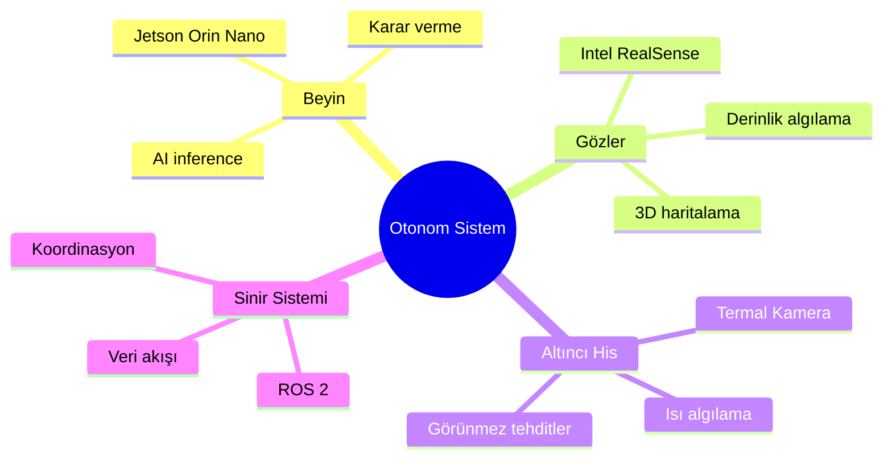
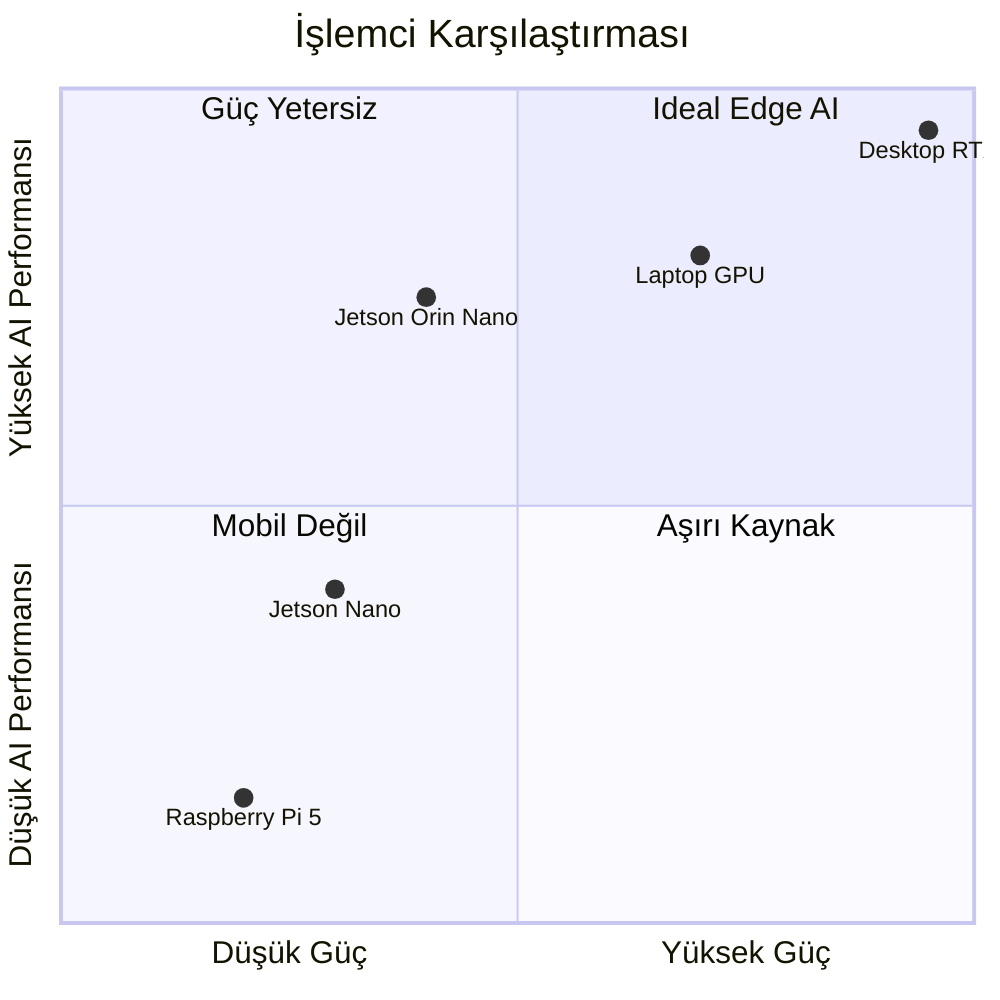
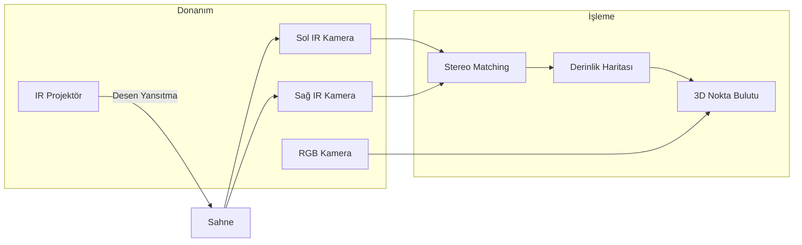
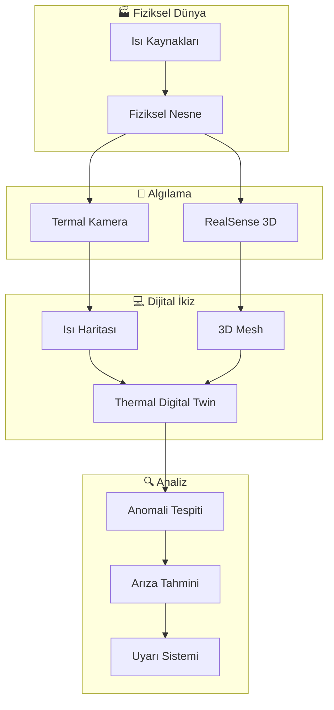
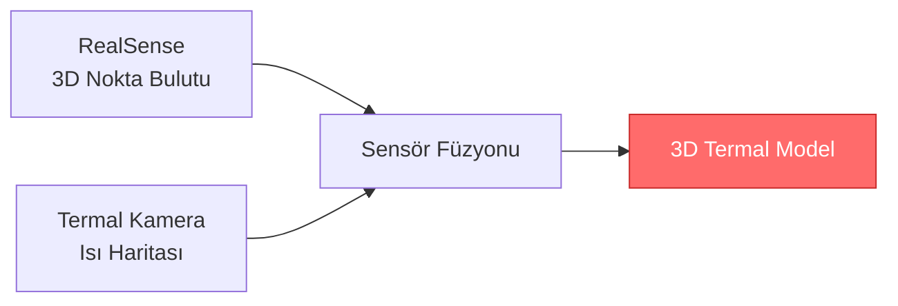
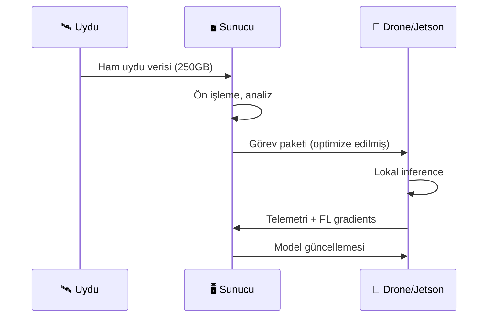
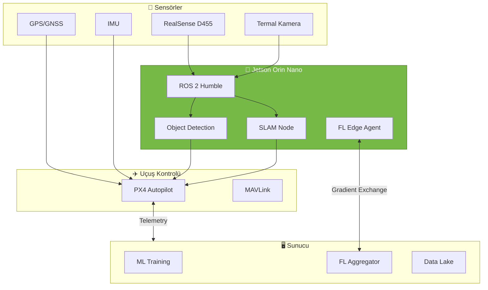

# 🧠 Donanım Anatomisi: Beyin, Gözler ve Altıncı His

> **"Bir insanın duyularını anlamadan zekasını anlayamazsın."** Bu prensip, otonom sistemler için de geçerlidir.

---

## 📋 İçindekiler

- [Giriş: İnsan-Robot Analojisi](#-giriş-insan-robot-analojisi)
- [🧠 Beyin: NVIDIA Jetson Orin Nano](#-beyin-nvidia-jetson-orin-nano)
- [👁️ Gözler: Intel RealSense D455](#️-gözler-intel-realsense-d455)
- [🔥 Altıncı His: UNI-T Termal Kamera](#-altıncı-his-uni-t-termal-kamera)
- [🖥️ Sunucu Altyapısı](#️-sunucu-altyapısı)
- [🔗 Entegrasyon Mimarisi](#-entegrasyon-mimarisi)
- [❌ Sık Karşılaşılan Sorunlar](#-sık-karşılaşılan-sorunlar)

---

## 🎯 Giriş: İnsan-Robot Analojisi

Otonom bir drone sistemini anlamanın en kolay yolu, onu insan vücuduyla karşılaştırmaktır:



| İnsan Organı | Robot Karşılığı | Fonksiyon |
|--------------|-----------------|-----------|
| 🧠 Beyin | Jetson Orin Nano | Düşünme, karar verme, öğrenme |
| 👁️ Gözler | Intel RealSense | Görme, mesafe ölçme, haritalama |
| 🔥 Altıncı His | Termal Kamera | Görünmeyen tehlikeleri algılama |
| 💪 Kaslar | Motor Sürücüler | Hareket etme |
| 🦴 İskelet | Drone Frame | Yapısal bütünlük |

---

## 🧠 Beyin: NVIDIA Jetson Orin Nano

### Günlük Hayat Analojisi

Jetson Orin Nano'yu, cebinize sığan bir **süper bilgisayar** olarak düşünün. Normal bir bilgisayar internetten video izleyebilir, ancak Jetson aynı anda:
- 📹 4 kameradan görüntü işleyebilir
- 🤖 Nesne tespiti yapabilir
- 🗺️ 3D haritalar oluşturabilir
- 🧭 Yol planlayabilir

Tüm bunları **bir sigara paketinden küçük** bir boyutta yapar!

### Teknik Özellikler

| Özellik | Değer | Önemi |
|---------|-------|-------|
| **GPU** | 1024 CUDA Core, Ampere | Paralel AI hesaplamaları |
| **AI Performansı** | 40 TOPS (INT8) | Gerçek zamanlı inference |
| **CPU** | 6-core Arm Cortex-A78AE | Genel amaçlı işlemler |
| **RAM** | 8GB LPDDR5 | Büyük modeller için yeterli |
| **Güç Tüketimi** | 7-15W | Bataryayı korur |
| **Boyut** | 69.6mm x 45mm | Kompakt, drone'a sığar |

### Neden Jetson? Alternatiflerle Karşılaştırma



| Platform | AI Performansı | Güç | Drone Uygunluğu |
|----------|---------------|-----|-----------------|
| Raspberry Pi 5 | ❌ Çok düşük | ✅ 5W | ⚠️ Basit projeler |
| Jetson Nano | ⚠️ Yeterli | ✅ 10W | ✅ Başlangıç |
| **Jetson Orin Nano** | ✅ Yüksek | ✅ 15W | ✅ **İdeal** |
| Laptop (RTX 3060) | ✅ Çok yüksek | ❌ 115W | ❌ Taşınamaz |

### Kullanım Senaryoları

1. **Gerçek Zamanlı Nesne Tespiti**
   - YOLOv8 modeli ile saniyede 30+ FPS
   - İnsanlar, araçlar, engeller tespiti
   
2. **Sürü Koordinasyonu (Swarm Intelligence)**
   - Lokal karar verme
   - Diğer drone'larla koordinasyon
   
3. **Termal Digital Twin**
   - Termal görüntüleri işleme
   - Isı anomalileri tespiti
   
4. **Federated Learning**
   - Lokal model güncellemeleri
   - Merkezi sunucuya gradient gönderme

### Entegrasyon Ön Gereksinimleri

```bash
# JetPack 6.0 (L4T 36.x)
# Ubuntu 22.04 tabanlı
# CUDA 12.2, cuDNN 8.9, TensorRT 8.6

# Kurulum kontrol komutu (örnek)
$ sudo apt-get update
$ sudo apt-get install nvidia-jetpack
$ jtop  # Sistem monitörü
```

---

## 👁️ Gözler: Intel RealSense D455

### Günlük Hayat Analojisi

İnsan gözleri **stereo görüş** kullanır - iki göz, aynı sahneyi farklı açılardan görür ve beyin bu farkı kullanarak **derinlik** hesaplar. RealSense D455 de tam olarak bunu yapar, ama çok daha hassas!

Bir yarasa nasıl karanlıkta sonar kullanıyorsa, RealSense de **Infrared (IR) projeksiyonu** kullanarak görünür ışık olmadan bile derinlik ölçebilir.

### Teknik Özellikler

| Özellik | Değer | Kullanım Alanı |
|---------|-------|----------------|
| **Derinlik Çözünürlüğü** | 1280×720 @ 90FPS | Hassas 3D haritalama |
| **RGB Çözünürlüğü** | 1280×800 @ 30FPS | Nesne tanıma |
| **Derinlik Aralığı** | 0.6m - 6m | İç/dış mekan uyumu |
| **Görüş Açısı (FOV)** | 87° × 58° | Geniş algılama |
| **IMU** | 6-axis (Gyro + Accel) | Hareket takibi |
| **Bağlantı** | USB 3.0 Type-C | Hızlı veri transferi |

### Derinlik Algılama Nasıl Çalışır?



### Kullanım Senaryoları

1. **Engel Algılama ve Kaçınma**
   ```
   Mesafe < 1m → DUR!
   Mesafe < 3m → Yavaşla
   Mesafe > 3m → Devam et
   ```

2. **SLAM (Simultaneous Localization and Mapping)**
   - Bilinmeyen ortamda harita oluşturma
   - Harita üzerinde konum belirleme
   - GPS olmadan navigasyon

3. **3D Nokta Bulutu (Point Cloud) Oluşturma**
   - Ortamın dijital ikizi (Digital Twin)
   - Hacim hesaplama
   - Değişiklik tespiti

4. **Visual Odometry**
   - Görüntü tabanlı hareket takibi
   - IMU ile sensör füzyonu
   - Drift düzeltme

### ROS 2 Entegrasyonu

```yaml
# realsense_config.yaml
realsense2_camera:
  ros__parameters:
    enable_depth: true
    enable_color: true
    enable_infra1: true
    enable_infra2: true
    enable_gyro: true
    enable_accel: true
    pointcloud.enable: true
    depth_module.profile: "640x480x30"
    rgb_camera.profile: "640x480x30"
```

---

## 🔥 Altıncı His: UNI-T Termal Kamera

### Günlük Hayat Analojisi

Düşünün ki, gece karanlığında bir odaya girdiniz. Normal gözlerinizle hiçbir şey göremezsiniz. Ama bir **süper güç** olarak her nesnenin yaydığı **ısıyı görebilseydiniz**?

- 🔴 Sıcak nesneler parlak kırmızı
- 🟡 Ilık nesneler sarı
- 🔵 Soğuk nesneler mavi

Bu, termal kameranın dünyayı gördüğü şekil! Işık olmasa bile, ısı varsa görürsünüz.

### Teknik Özellikler

| Özellik | Değer | Önemi |
|---------|-------|-------|
| **Termal Çözünürlük** | 256×192 piksel | Detaylı ısı haritası |
| **Sıcaklık Aralığı** | -20°C ~ 550°C | Geniş uygulama alanı |
| **Hassasiyet (NETD)** | <40mK | Küçük farkları algılar |
| **Görüş Açısı** | 56° × 42° | Orta alan tarama |
| **Görüntü Hızı** | 25Hz | Akıcı görüntü |
| **Bağlantı** | USB-C | Jetson uyumlu |

### Termal Digital Twin Kavramı



### Kullanım Senaryoları

1. **Enerji Kaçağı Tespiti**
   - Bina yalıtım kontrolleri
   - Pencere/kapı sızıntıları
   - Isıtma sistemi verimsizlikleri

2. **Ekipman Arıza Tahmini (Predictive Maintenance)**
   - Motor aşırı ısınması
   - Elektrik bağlantı sorunları
   - Rulman arızaları

3. **Yangın Önleme**
   - Hotspot tespiti
   - Orman yangını erken uyarı
   - Endüstriyel risk analizi

4. **Tarımsal İzleme**
   - Bitki stresi tespiti
   - Sulama verimliliği
   - Hastalık erken teşhisi

### Sensör Füzyonu: RealSense + Termal



| Tek Başına | Birlikte Kullanım |
|------------|-------------------|
| RealSense: Şekil bilgisi | 3D + Isı = Anlamlı veri |
| Termal: Sıcaklık bilgisi | Hangi nesne sıcak? |
| Bağlamdan yoksun | Bağlamsal analiz |

---

## 🖥️ Sunucu Altyapısı

### Merkezi İşlem Gücü

| Bileşen | Spesifikasyon | Görev |
|---------|---------------|-------|
| **GPU** | NVIDIA RTX 5080/5090 | Model eğitimi, uydu verisi işleme |
| **RAM** | 128-256 GB DDR5 | Büyük veri setleri (250-300GB) |
| **Storage** | NVMe SSD RAID | Hızlı I/O işlemleri |
| **OS** | Ubuntu 22.04 LTS | Ana işletim sistemi |
| **Backup OS** | Windows Server | Spesifik yazılımlar |

### Sunucu-Edge İletişim



---

## 🔗 Entegrasyon Mimarisi

### Tam Sistem Diyagramı



---

## ❌ Sık Karşılaşılan Sorunlar

### Jetson Orin Nano

| Sorun | Belirti | Çözüm |
|-------|---------|-------|
| 🌡️ Thermal Throttling | FPS düşüşü, performans kaybı | Fan ekle, heatsink kontrol et |
| ⚡ Power Issues | Ani kapanmalar | 5V/4A güç kaynağı kullan |
| 📦 SDK Version Mismatch | Import hataları | JetPack sürümünü kontrol et |
| 🔌 USB Bandwidth | Sensör veri kaybı | USB 3.0 hub kullanma |

### Intel RealSense

| Sorun | Belirti | Çözüm |
|-------|---------|-------|
| 🔌 USB Connection | "No device detected" | USB 3.0 port, kablo kalitesi |
| ☀️ IR Interference | Derinlik gürültüsü | Güneş ışığından kaçın |
| 🖼️ Frame Drops | Kesintili görüntü | Çözünürlüğü düşür |
| 🔄 Firmware | Beklenmeyen davranış | SDK ile firmware güncelle |

### Termal Kamera

| Sorun | Belirti | Çözüm |
|-------|---------|-------|
| 📏 Kalibrasyon | Yanlış sıcaklık değerleri | Karakutu kalibrasyonu |
| 🪞 Yansıma | Gölge ısı noktaları | Emisivite ayarı |
| 🔗 Bağlantı | Cihaz tanınmıyor | USB driver güncelle |

---

## 📚 Daha Fazla Okuma

### Resmi Dokümantasyon
- [Jetson Orin Nano Developer Kit](https://developer.nvidia.com/embedded/learn/get-started-jetson-orin-nano-devkit)
- [Intel RealSense SDK 2.0](https://github.com/IntelRealSense/librealsense)
- [UNI-T Thermal Imaging](https://thermal.uni-trend.com/)

### Örnek Projeler
- [Jetson AI Fundamentals](https://developer.nvidia.com/embedded/learn/jetson-ai-certification-programs)
- [RealSense ROS2 Wrapper](https://github.com/IntelRealSense/realsense-ros)

---

> 💡 **Sonraki Adım:** [01-Concepts/digital-twin-swarm.md](../01-Concepts/digital-twin-swarm.md) - Temel kavramları öğren
