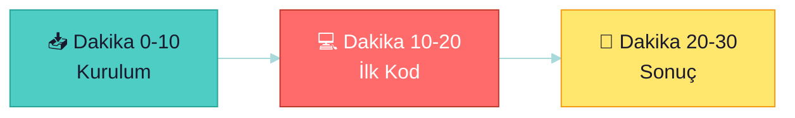
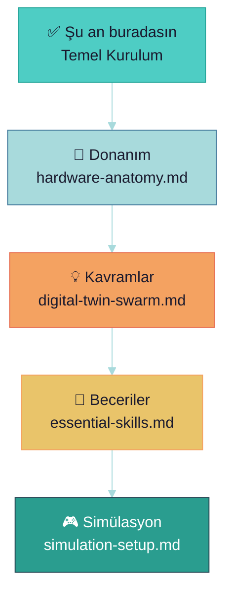

# ⚡ Hızlı Başlangıç Rehberi: İlk 30 Dakika

> **"Bir yolculuk bin adımla başlar - bu ilk 30 dakikan."**

---

## 📋 İçindekiler

- [Genel Bakış](#-genel-bakış)
- [Adım 1: Ortamı Hazırla](#-adım-1-ortamı-hazırla)
- [Adım 2: İlk Kodu Çalıştır](#-adım-2-ilk-kodu-çalıştır)
- [Adım 3: Sonraki Adımlar](#-adım-3-sonraki-adımlar)

---

## 🎯 Genel Bakış



| Dakika | Aktivite | Sonuç |
|--------|----------|-------|
| 0-10 | Ortam kontrolü | Hazır sistem |
| 10-20 | İlk script | Çalışan kod |
| 20-30 | Sonraki adımlar | Yol haritası |

---

## 📥 Adım 1: Ortamı Hazırla (10 dk)

### Sistem Gereksinimleri

| Bileşen | Minimum | Önerilen |
|---------|---------|----------|
| OS | Ubuntu 20.04 | Ubuntu 22.04 LTS |
| RAM | 8 GB | 16 GB+ |
| Disk | 50 GB | 100 GB+ |
| Python | 3.8 | 3.10+ |

### Hızlı Kontrol Scripti

```bash
#!/bin/bash
# quick_check.sh - Sistem kontrolü

echo "🔍 Sistem Kontrolü Başlıyor..."
echo ""

# Ubuntu sürümü
echo "📌 OS Sürümü:"
lsb_release -a 2>/dev/null | grep Description

# Python
echo ""
echo "🐍 Python Sürümü:"
python3 --version

# Pip
echo ""
echo "📦 Pip Sürümü:"
pip3 --version

# Git
echo ""
echo "🔀 Git Sürümü:"
git --version

# RAM
echo ""
echo "💾 RAM Durumu:"
free -h | grep Mem

echo ""
echo "✅ Kontrol tamamlandı!"
```

### Temel Paketler

```bash
# Sistem paketleri
sudo apt update && sudo apt upgrade -y
sudo apt install -y python3-pip python3-venv git curl

# Python ortamı
python3 -m venv ~/drone_env
source ~/drone_env/bin/activate

# Temel kütüphaneler
pip install numpy opencv-python matplotlib
```

---

## 💻 Adım 2: İlk Kodu Çalıştır (10 dk)

### Merhaba Drone!

```python
#!/usr/bin/env python3
"""
hello_drone.py - İlk drone projesi scripti
"""

import numpy as np
import cv2
import sys

def print_banner():
    """Proje banner'ı göster"""
    banner = """
    ╔══════════════════════════════════════╗
    ║  🚁 Thermal Digital Twin Project     ║
    ║  ─────────────────────────────────── ║
    ║  Swarm Intelligence | Federated AI   ║
    ╚══════════════════════════════════════╝
    """
    print(banner)

def check_opencv():
    """OpenCV kontrolü"""
    print(f"✅ OpenCV Sürümü: {cv2.__version__}")
    return True

def check_numpy():
    """NumPy kontrolü"""
    print(f"✅ NumPy Sürümü: {np.__version__}")
    
    # Basit array testi
    arr = np.random.rand(3, 3)
    print(f"✅ NumPy Test Array:\n{arr}")
    return True

def camera_test():
    """Kamera testi (opsiyonel)"""
    try:
        cap = cv2.VideoCapture(0)
        if cap.isOpened():
            ret, frame = cap.read()
            if ret:
                print(f"✅ Kamera Çözünürlüğü: {frame.shape}")
            cap.release()
            return True
        else:
            print("⚠️ Kamera bulunamadı (opsiyonel)")
            return False
    except Exception as e:
        print(f"⚠️ Kamera testi atlandı: {e}")
        return False

def main():
    print_banner()
    print("🔍 Sistem Kontrolü\n")
    
    all_ok = True
    all_ok &= check_numpy()
    all_ok &= check_opencv()
    camera_test()  # Opsiyonel
    
    print("\n" + "="*40)
    if all_ok:
        print("🎉 Tüm kontroller başarılı!")
        print("📚 Sonraki adım: ROS 2 kurulumu")
    else:
        print("❌ Bazı kontroller başarısız")
    
    return 0 if all_ok else 1

if __name__ == "__main__":
    sys.exit(main())
```

### Çalıştırma

```bash
# Script'i kaydet
nano hello_drone.py

# Çalıştır
python3 hello_drone.py
```

**Beklenen Çıktı:**
```
    ╔══════════════════════════════════════╗
    ║  🚁 Thermal Digital Twin Project     ║
    ╚══════════════════════════════════════╝
    
🔍 Sistem Kontrolü

✅ NumPy Sürümü: 1.24.0
✅ OpenCV Sürümü: 4.8.0
🎉 Tüm kontroller başarılı!
```

---

## 🎉 Adım 3: Sonraki Adımlar (10 dk)

### Öğrenme Yolu



### Önerilen Okuma Sırası

| Sıra | Dosya | Süre |
|------|-------|------|
| 1 | [hardware-anatomy.md](./hardware-anatomy.md) | 15 dk |
| 2 | [digital-twin-swarm.md](../01-Concepts/digital-twin-swarm.md) | 20 dk |
| 3 | [essential-skills.md](../03-Software-Stack/essential-skills.md) | 15 dk |

---

## ✅ Checklist

- [ ] Ubuntu 22.04 kurulu
- [ ] Python 3.10+ çalışıyor
- [ ] Virtual environment oluşturuldu
- [ ] hello_drone.py başarılı
- [ ] Sonraki adımlar belirlendi

---

> 💡 **Sonraki:** [hardware-anatomy.md](./hardware-anatomy.md) - Donanımı tanı
