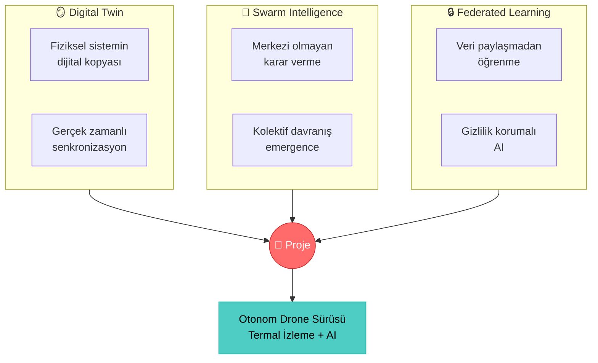
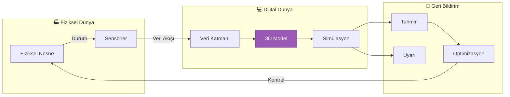
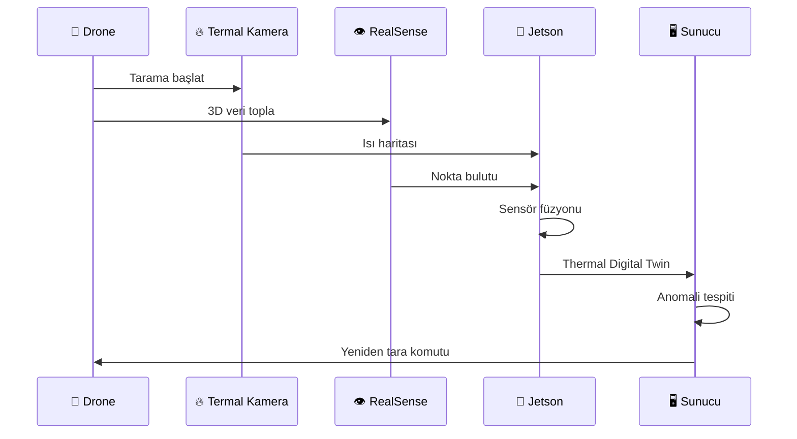
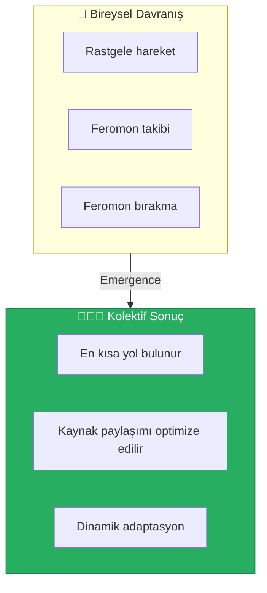
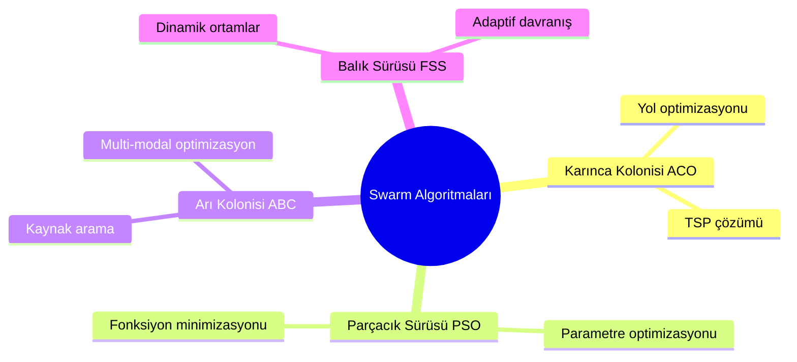
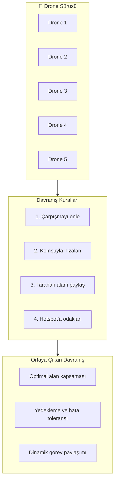
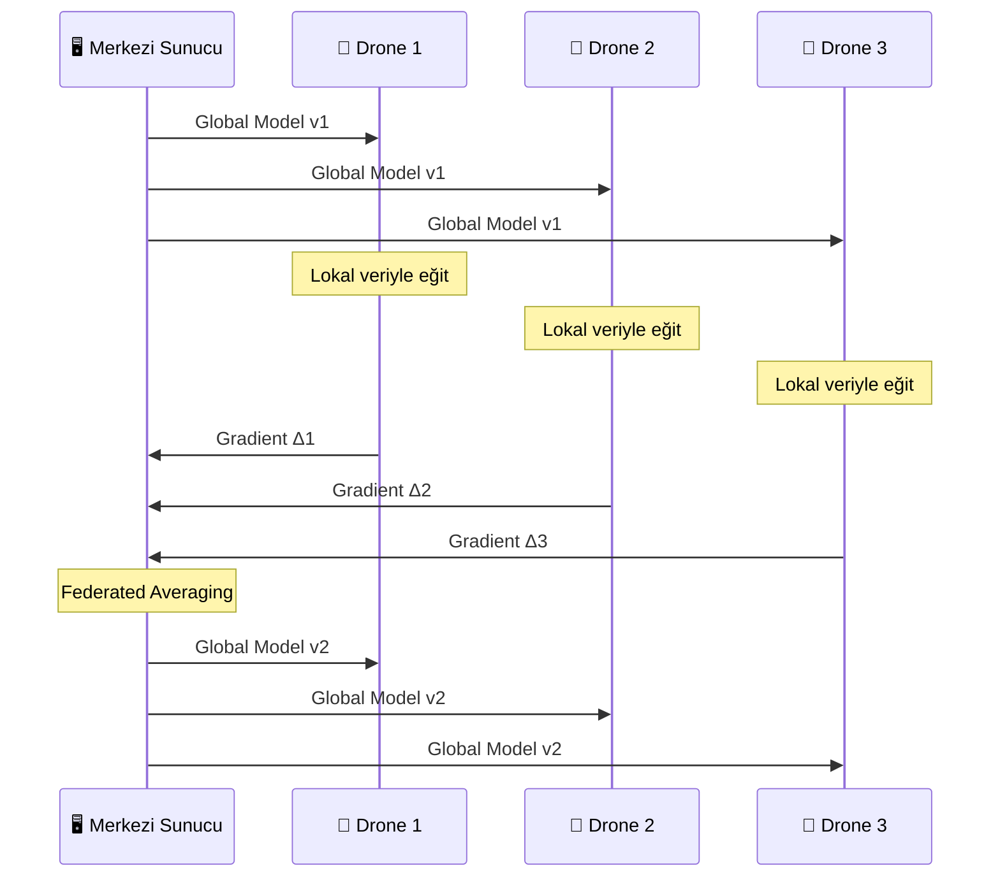
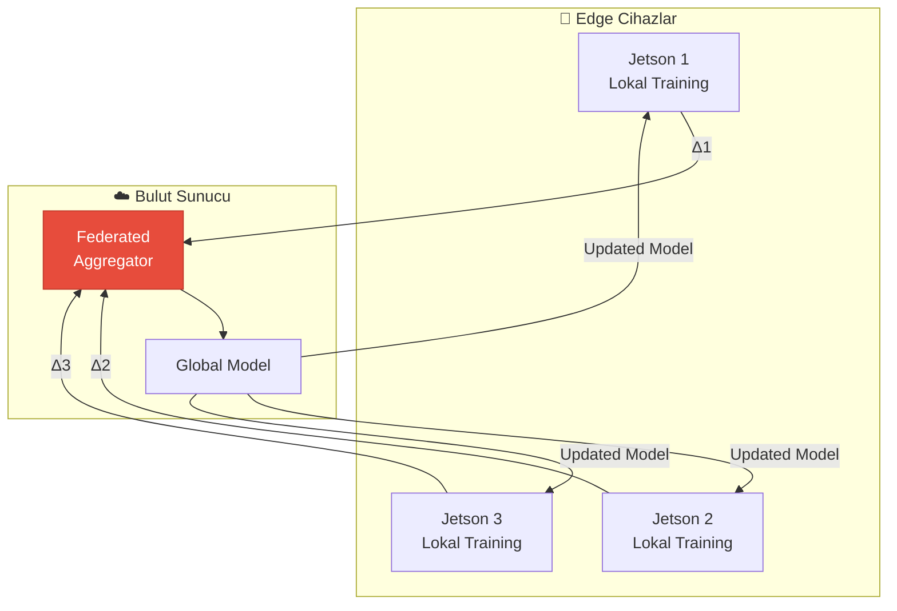
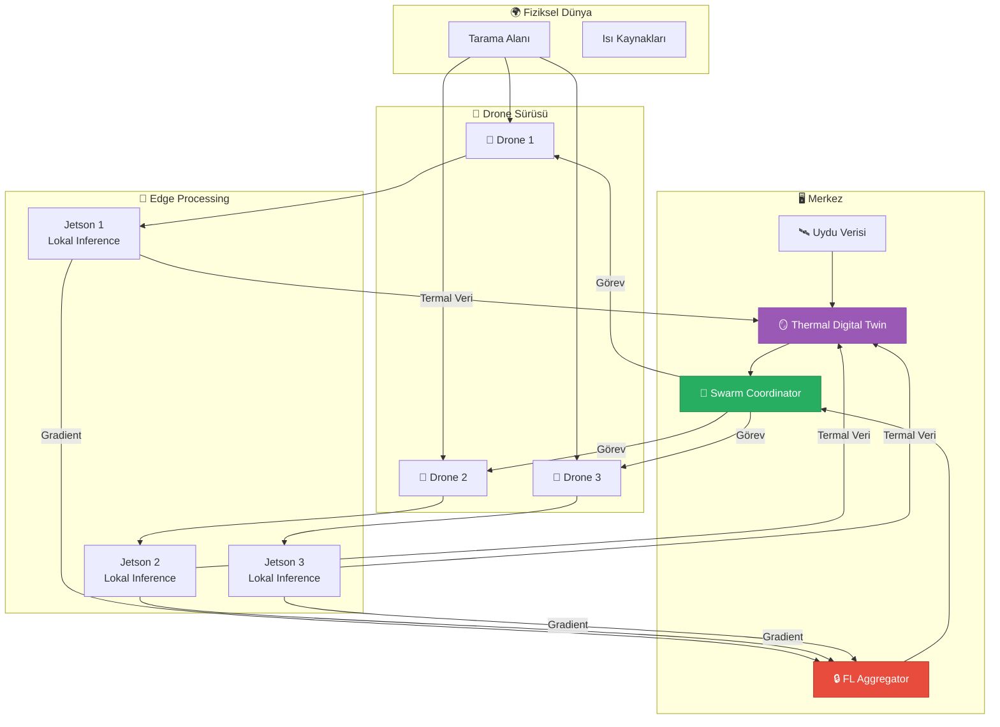
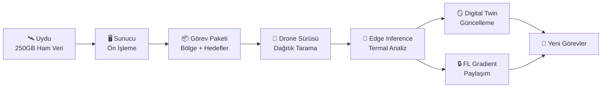

# 🔥 Temel Kavramlar: Digital Twin, Swarm Intelligence ve Federated Learning

> **"Tek bir karınca akıllı değildir, ama bir karınca kolonisi harikalar yaratır."** - Deborah Gordon

---

## 📋 İçindekiler

- [Giriş: Üç Kavramın Kesişimi](#-giriş-üç-kavramın-kesişimi)
- [🪞 Digital Twin (Dijital İkiz)](#-digital-twin-dijital-ikiz)
- [🐝 Swarm Intelligence (Sürü Zekası)](#-swarm-intelligence-sürü-zekası)
- [🔒 Federated Learning (Dağıtık Öğrenme)](#-federated-learning-dağıtık-öğrenme)
- [🏗️ Entegre Mimari](#️-entegre-mimari)
- [🔬 Mini Proje Fikirleri](#-mini-proje-fikirleri)

---

## 🌐 Giriş: Üç Kavramın Kesişimi

Bu projede üç güçlü kavramı birleştiriyoruz:

| Kavram | Proje Rolü |
|--------|------------|
| Digital Twin | Ortamın termal modelini oluşturma |
| Swarm Intelligence | Drone'ların koordineli hareket etmesi |
| Federated Learning | Her drone'un öğrendiklerini güvenli paylaşması |

---

## 🪞 Digital Twin (Dijital İkiz)

### Günlük Hayat Analojisi

**Video oyunlarını düşünün.** Karakteriniz bir şehirde koşuyor - bu şehir gerçek değil, ama gerçek bir şehrin dijital kopyası. 

- Google Maps'te sokak görünümüne baktığınızda → Statik Digital Twin
- Bir yarış oyununda İstanbul'u sürdüğünüzde → İnteraktif Digital Twin
- Tesla fabrikasının simülasyonu → Endüstriyel Digital Twin

**Bizim projemizde:** Termal kamera ile taranan bir binanın dijital modeli. Bu model sadece 3D şekil değil, aynı zamanda **ısı dağılımını** da içeriyor = **Thermal Digital Twin**

### Teknik Tanım

> **Digital Twin (Dijital İkiz):** Fiziksel bir varlığın, sürecin veya sistemin, sensör verileriyle gerçek zamanlı güncellenen sanal temsilidir.

### Digital Twin Tipleri

| Tip | Açıklama | Örnek |
|-----|----------|-------|
| **Component Twin** | Tek parça | Motor rulmanı |
| **Asset Twin** | Sistem bileşenleri | Komple motor |
| **System Twin** | Birden fazla asset | Fabrika üretim hattı |
| **Process Twin** | Süreç simülasyonu | Tedarik zinciri |

### Thermal Digital Twin - Bu Projede

**Uygulama Senaryoları:**

1. **Bina Enerji Denetimi**
   - Isı kaçağı tespiti
   - Yalıtım kalitesi değerlendirmesi
   - Enerji verimliliği raporu

2. **Endüstriyel Bakım**
   - Ekipman aşırı ısınması
   - Elektrik arızası tahmini
   - Preventive maintenance planlaması

3. **Tarım İzleme**
   - Bitki stres haritası
   - Sulama optimizasyonu
   - Hastalık erken uyarı

---

## 🐝 Swarm Intelligence (Sürü Zekası)

### Günlük Hayat Analojisi

**Bir karınca kolonisini gözlemleyin:**

- Tek bir karınca rastgele dolaşır
- Yiyecek bulunca **feromon** bırakır
- Diğer karıncalar feromonu takip eder
- En kısa yol **kendi kendine** ortaya çıkar

**Kimse karıncalara "bu yoldan git" demedi!** Bu, **emergence** (ortaya çıkış) fenomenidir.

### Teknik Tanım

> **Swarm Intelligence (Sürü Zekası):** Basit kuralları takip eden çok sayıda ajanın, merkezi kontrol olmadan kolektif olarak akıllı davranışlar sergilemesidir.

### Temel Prensipler

| Prensip | Açıklama | Drone Uygulaması |
|---------|----------|------------------|
| **Proximity** | Komşuların algılanması | Radar/kamera ile mesafe |
| **Alignment** | Aynı yöne hareket | Ortak hedef koordinatı |
| **Cohesion** | Birlikte kalma | Minimum mesafe koruması |
| **Separation** | Çarpışma önleme | Güvenli mesafe |

### Swarm Algoritmaları

### Bu Projede: Drone Sürüsü

**Senaryo:** 5 drone'un bir orman alanını termal taraması

### Otonom Uçuş ve Yön Bulma

| Yöntem | Açıklama | Avantaj/Dezavantaj |
|--------|----------|-------------------|
| **GPS Tabanlı** | Uydu koordinatları | ✅ Global, ❌ Kapalı alan yok |
| **Visual SLAM** | Kamera ile haritalama | ✅ GPS'siz, ❌ Karanlık sorun |
| **Beacon Tabanlı** | UWB/WiFi sinyalleri | ✅ İç mekan, ❌ Altyapı gerek |
| **Sürü Tabanlı** | Komşu takibi | ✅ Altyapısız, ❌ Tek fail yok |

---

## 🔒 Federated Learning (Dağıtık Öğrenme)

### Günlük Hayat Analojisi

**Bir sınıf hayal edin:**

Geleneksel (Merkezi) Öğrenme:
1. Herkes defterini öğretmene verir
2. Öğretmen hepsini okur
3. Öğretmen özet çıkarır
4. Özeti herkese dağıtır

**Problem:** Defterler gizli bilgi içerebilir!

Federated Learning:
1. Herkes kendi defterinden öğrenir
2. Sadece **öğrendiklerini** (gradient) paylaşır
3. Öğretmen öğrenmeleri birleştirir
4. Birleşik bilgi herkese gider

**Defter (veri) asla paylaşılmadı!** 🔒

### Teknik Tanım

> **Federated Learning (Dağıtık Öğrenme):** Makine öğrenimi modelinin, verileri merkezi bir sunucuya göndermeden, dağıtık cihazlarda eğitilmesi yöntemidir.

### Neden Federated Learning?

| Geleneksel ML | Federated Learning |
|---------------|-------------------|
| Tüm veri merkezde | Veri cihazda kalır |
| Büyük bant genişliği | Sadece gradient gönderilir |
| Merkezi hata noktası | Dağıtık, dayanıklı |
| Gizlilik riski | Gizlilik korumalı |

### Edge Computing İlişkisi

### Bu Projede: Drone Fleet Learning

**Senaryo:** Her drone farklı bir bölgeyi tarıyor

| Drone | Bölge | Öğrendiği |
|-------|-------|-----------|
| Drone 1 | Orman | Yangın sıcaklık profili |
| Drone 2 | Şehir | Bina ısı kaçağı paterni |
| Drone 3 | Tarla | Bitki stres imzası |

**Sonuç:** Hiçbir drone diğerinin verisini görmeden, tüm bilgileri içeren bir model ortaya çıkıyor!

### FL Algoritmaları

| Algoritma | Açıklama | Kullanım |
|-----------|----------|----------|
| **FedAvg** | Weighted ortalamalı aggregation | Standart senaryo |
| **FedProx** | Heterogeneous cihazlar için | Farklı Jetson modelleri |
| **FedMA** | Model matching | Farklı mimariler |

---

## 🏗️ Entegre Mimari

### Üç Kavramın Birleşimi

### Veri Akış Pipeline

---

## 🔬 Mini Proje Fikirleri

### Seviye 1: Digital Twin Temelleri
**Proje:** Tek kamera ile oda haritalaması
- RealSense ile 3D mesh oluştur
- Termal overlay ekle (simüle edilebilir)
- Basit anomali tespiti

### Seviye 2: Swarm Simülasyonu
**Proje:** 5 sanal drone koordinasyonu
- Gazebo simülasyonu
- Reynolds Boids algoritması
- Alan kaplama optimizasyonu

### Seviye 3: Federated Learning Demo
**Proje:** 3 Jetson cihazda dağıtık eğitim
- MNIST/CIFAR basit model
- Flower framework ile FL
- Gradient exchange izleme

### Seviye 4: Entegre Sistem
**Proje:** Küçük ölçekli prototip
- 2-3 drone (simülasyon)
- Thermal Digital Twin
- FL ile model güncelleme

---

## 📚 Daha Fazla Okuma

### Akademik Makaleler
- [Digital Twin: A Comprehensive Survey](https://arxiv.org/abs/2011.02833)
- [Swarm Intelligence: From Natural to Artificial Systems](https://mitpress.mit.edu/9780195131598/)
- [Communication-Efficient Learning of Deep Networks from Decentralized Data](https://arxiv.org/abs/1602.05629) (FedAvg orijinal paper)

### Pratik Kaynaklar
- [NVIDIA Isaac Sim](https://developer.nvidia.com/isaac-sim) - Digital Twin simülasyonu
- [PX4 Swarm Examples](https://docs.px4.io/) - Sürü uçuş örnekleri
- [Flower FL Framework](https://flower.dev/) - Python FL kütüphanesi

---

> 💡 **Sonraki Adım:** [03-Software-Stack/essential-skills.md](../03-Software-Stack/essential-skills.md) - Gerekli becerileri öğren
