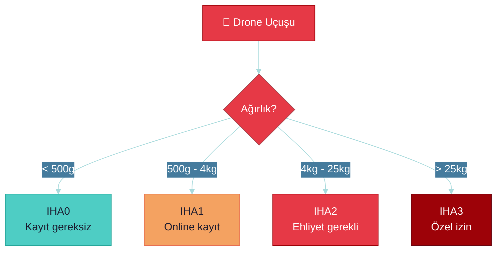
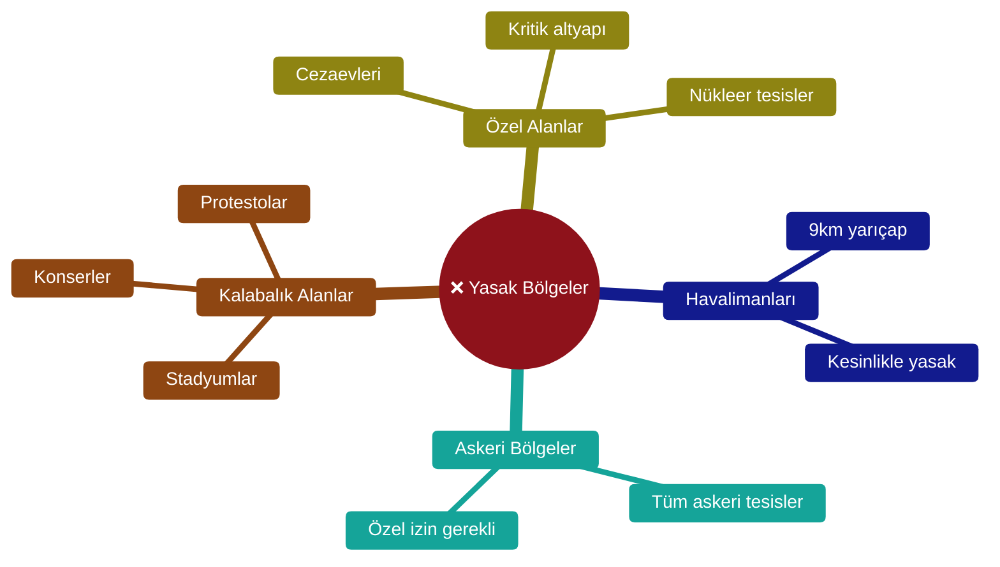
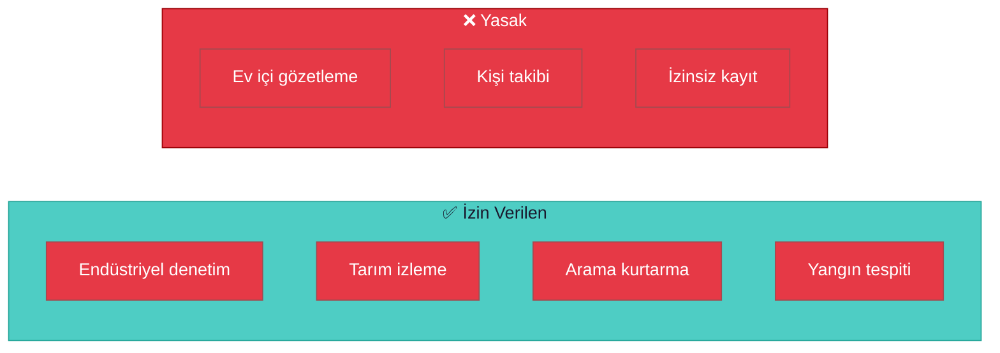
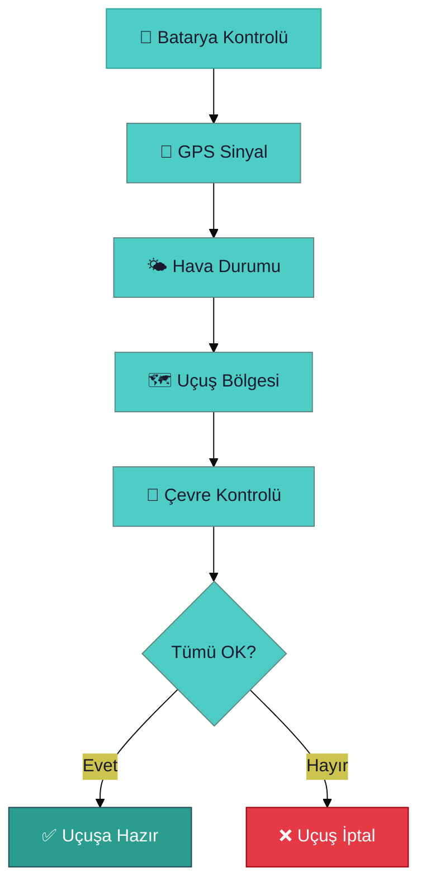

# ⚠️ Güvenlik ve Etik Rehberi

> **"Teknoloji güçtür - güç sorumluluk getirir."**

---

## 📋 İçindekiler

- [Türkiye Drone Mevzuatı](#-türkiye-drone-mevzuatı)
- [Termal Kamera Etik Sınırları](#-termal-kamera-etik-sınırları)
- [Veri Güvenliği](#-veri-güvenliği)
- [Uçuş Güvenliği](#-uçuş-güvenliği)

---

## 🇹🇷 Türkiye Drone Mevzuatı

### SHGM (Sivil Havacılık Genel Müdürlüğü) Kuralları



### Drone Sınıfları

| Sınıf | Ağırlık | Gereklilikler |
|-------|---------|---------------|
| **IHA0** | < 500g | Kayıt gereksiz, temel kurallar |
| **IHA1** | 500g - 4kg | Online kayıt, pilot belgesi yok |
| **IHA2** | 4kg - 25kg | Pilot belgesi zorunlu |
| **IHA3** | > 25kg | Özel izin, sigorta zorunlu |

### Yasak Bölgeler



### Uçuş Kuralları Özeti

| Kural | Açıklama |
|-------|----------|
| ✅ Gündüz uçuşu | Gün doğumu - gün batımı |
| ✅ Görüş mesafesi | Pilot drone'u görmeli (VLOS) |
| ✅ Maksimum yükseklik | 120 metre AGL |
| ❌ İnsanların üzeri | Yasak |
| ❌ Şehir merkezleri | Özel izin gerekli |

### Kayıt Süreci

1. [shgm.gov.tr](https://iha.shgm.gov.tr/) adresine git
2. E-Devlet ile giriş yap
3. Drone bilgilerini gir (seri no, marka, model)
4. Sorumluluk beyanını kabul et
5. Kayıt belgesini indir

---

## 🔥 Termal Kamera Etik Sınırları

### Gizlilik Kaygıları



### Etik Kullanım Kuralları

| Durum | İzin | Açıklama |
|-------|------|----------|
| Bina dışı enerji denetimi | ✅ | Ticari/endüstriyel amaçlı |
| Tarım bitki stresi | ✅ | Kendi arazinde |
| Yangın tespiti | ✅ | Kamu güvenliği |
| Konut içi görüntüleme | ❌ | Gizlilik ihlali |
| Kişileri tanımlama | ❌ | Etik ihlal |
| İzinsiz kayıt paylaşımı | ❌ | Yasal suç |

### Veri Minimizasyonu İlkesi

```
Topla → Sadece gerekli veriyi
Sakla → Minimum süre
Paylaş → Sadece yetkililere
Sil → Amaca ulaşınca
```

---

## 🔒 Veri Güvenliği

### Veri Sınıflandırması

| Kategori | Örnek | Koruma Seviyesi |
|----------|-------|-----------------|
| **Herkese Açık** | Proje kodu (açık kaynak) | 🟢 Düşük |
| **İç Kullanım** | Telemetri logları | 🟡 Orta |
| **Gizli** | Termal görüntüler | 🔴 Yüksek |
| **Kişisel Veri** | Konum verileri | 🔴 KVKK kapsamı |

### KVKK Uyumu

**Kişisel Verilerin Korunması Kanunu (6698)**

| Madde | Gereklilik |
|-------|------------|
| Açık Rıza | Veri toplamadan önce onay |
| Amaç Sınırlaması | Belirlenen amaç dışı kullanım yasak |
| Veri Minimizasyonu | Sadece gerekli veri toplanmalı |
| Saklama Süresi | Belirlenen süre sonrası silme |
| Güvenlik | Şifreleme, erişim kontrolü |

---

## ✈️ Uçuş Güvenliği

### Pre-Flight Checklist



### Acil Durum Prosedürleri

| Durum | Eylem |
|-------|-------|
| 🔋 Batarya Düşük | Hemen RTH (Return to Home) |
| 📡 Sinyal Kaybı | Otomatik RTH bekle |
| ⚠️ Motor Arızası | Acil iniş, uzak dur |
| 🌧️ Ani Hava | Derhal iniş |

---

## ✅ Güvenlik Checklist

- [ ] SHGM kaydı yapıldı
- [ ] Uçuş bölgesi kontrol edildi
- [ ] Hava durumu uygun
- [ ] Batarya %100
- [ ] GPS lock var
- [ ] Termal kayıt onayı alındı
- [ ] Acil durum planı hazır

---

> 💡 **Resmi Kaynak:** [SHGM İHA Portalı](https://iha.shgm.gov.tr/)
