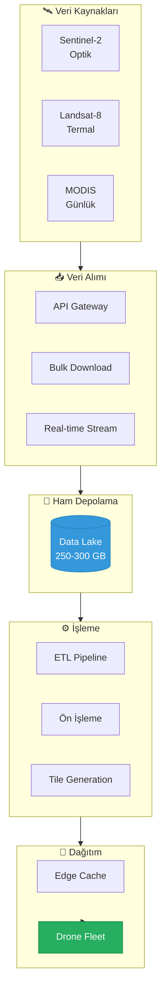
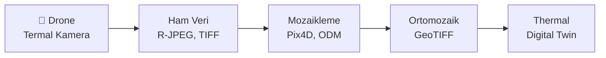
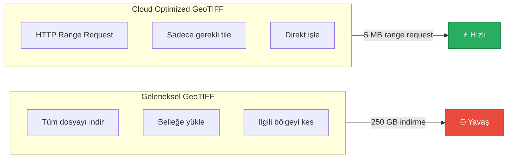
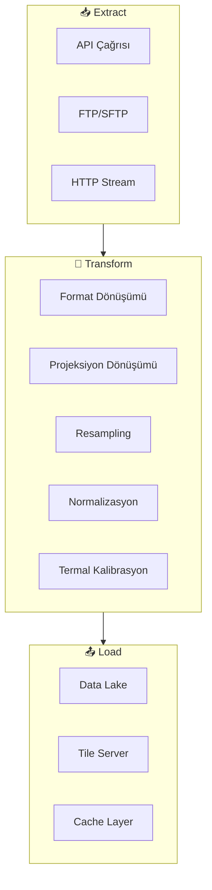
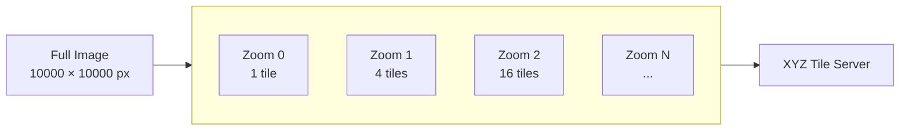
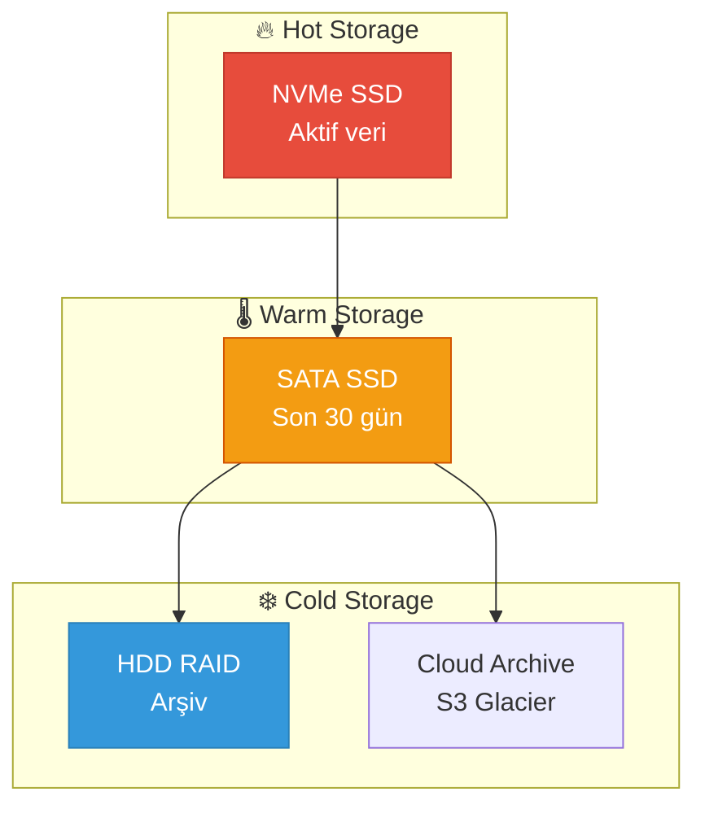
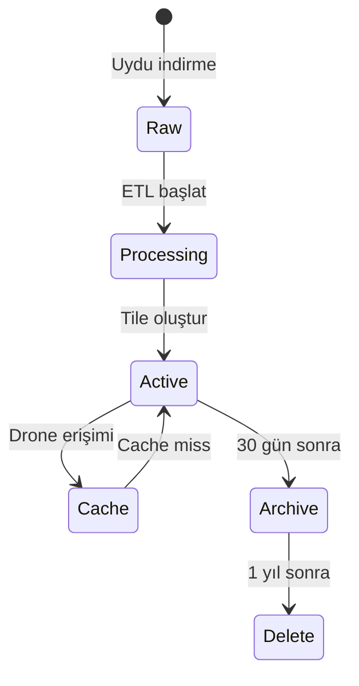
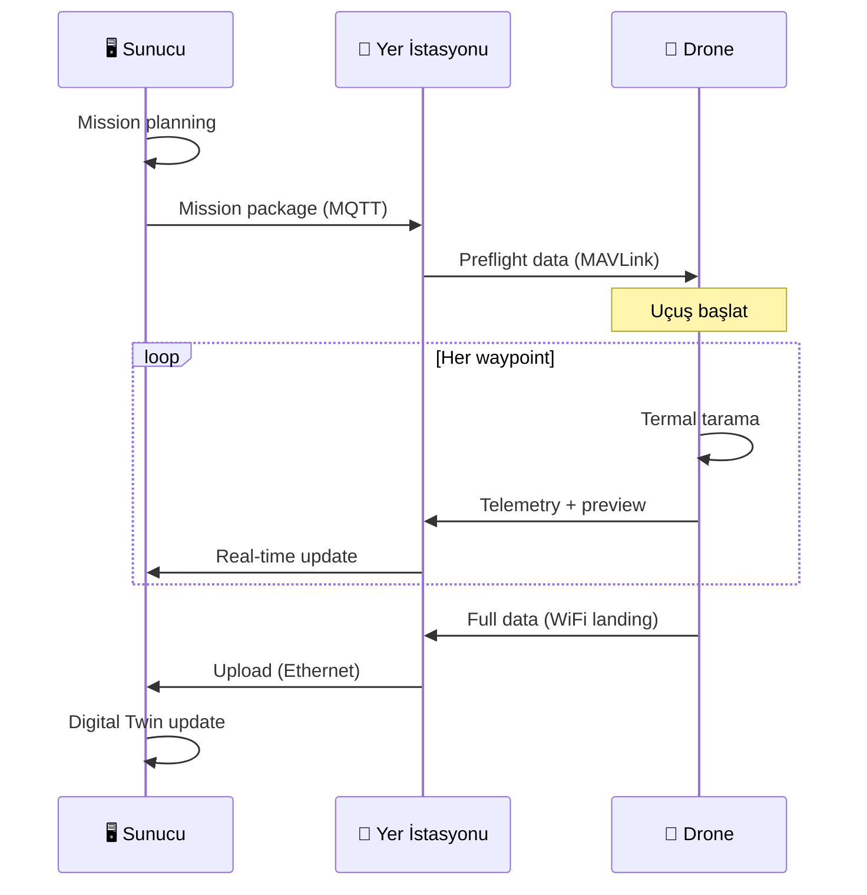

# 🛰️ Veri Yönetimi: Uydu Verisinden Drone Sürüsüne

> **"Veri, 21. yüzyılın petrolüdür - ama sadece rafine edildiğinde değer kazanır."**

---

## 📋 İçindekiler

- [Veri Akış Mimarisi](#-veri-akış-mimarisi)
- [Uydu Veri Kaynakları](#️-uydu-veri-kaynakları)
- [Veri Formatları](#-veri-formatları)
- [ETL Pipeline](#-etl-pipeline)
- [Depolama Stratejileri](#-depolama-stratejileri)
- [Drone'a Veri İletimi](#-dronea-veri-iletimi)

---

## 🌊 Veri Akış Mimarisi

### Büyük Resim



### Veri Boyutu Gerçekleri

| Aşama | Veri Boyutu | Format | Açıklama |
|-------|-------------|--------|----------|
| Ham Uydu | 250-300 GB | GeoTIFF, HDF5 | Tam çözünürlük, tüm bantlar |
| İşlenmiş | 50-80 GB | COG, Zarr | Optimize edilmiş, sıkıştırılmış |
| Tile Seti | 10-20 GB | PNG/WebP tiles | Drone erişimi için |
| Görev Paketi | 100-500 MB | JSON + tiles | Tek drone görevi |

---

## 🛰️ Uydu Veri Kaynakları

### Senaryo A: Açık Uydu Verileri (Ücretsiz)

| Kaynak | Çözünürlük | Temporal | Termal | API |
|--------|------------|----------|--------|-----|
| **Sentinel-2** | 10m (optik) | 5 gün | ❌ | ✅ Copernicus |
| **Landsat-8/9** | 30m | 16 gün | ✅ TIRS | ✅ USGS |
| **MODIS** | 250m-1km | Günlük | ✅ | ✅ NASA |
| **VIIRS** | 375m | Günlük | ✅ | ✅ NOAA |

```mermaid
gantt
    title Uydu Geçiş Zaman Çizelgesi
    dateFormat HH:mm
    axisFormat %H:%M
    
    section Sentinel-2
    Türkiye Geçişi    :s1, 10:00, 30m
    
    section Landsat-8
    Türkiye Geçişi    :l1, 10:15, 30m
    
    section MODIS Terra
    Türkiye Geçişi    :m1, 10:30, 20m
    
    section MODIS Aqua
    Türkiye Geçişi    :m2, 13:30, 20m
```



#### Copernicus Open Access Hub

```python
# Örnek - Sentinel-2 veri çekme (sentinelsat)
from sentinelsat import SentinelAPI

api = SentinelAPI('user', 'password', 'https://scihub.copernicus.eu/dhus')

# Türkiye bölgesi için sorgu
footprint = "POLYGON((26.0 36.0, 45.0 36.0, 45.0 42.0, 26.0 42.0, 26.0 36.0))"

products = api.query(
    footprint,
    date=('20240101', '20240131'),
    platformname='Sentinel-2',
    cloudcoverpercentage=(0, 30)
)
```

### Senaryo B: Ticari Uydu Verileri

| Sağlayıcı | Çözünürlük | Maliyet | Avantaj |
|-----------|------------|---------|---------|
| **Planet Labs** | 3m günlük | $$/km² | Yüksek temporal |
| **Maxar** | 30cm | $$$/km² | Ultra yüksek çözünürlük |
| **BlackBridge** | 5m | $$/km² | Tarım odaklı |

### Senaryo C: Kendi Verin (Drone Çekimi)



| Drone Sensör | Format | Çözünürlük | Kullanım |
|--------------|--------|------------|----------|
| DJI Zenmuse H20T | TIFF | 640×512 termal | Endüstriyel |
| FLIR Vue Pro | R-JPEG | 640×512 | Tarım |
| UNI-T UTi260B | BMP/JPEG | 256×192 | Bu proje |

---

## 📁 Veri Formatları

### Raster Formatları Karşılaştırması

| Format | Uzantı | Sıkıştırma | Cloud Optimized | Kullanım |
|--------|--------|------------|-----------------|----------|
| **GeoTIFF** | .tif | LZW, JPEG | ❌ | Standart |
| **COG** | .tif | LZW, ZSTD | ✅ | Modern |
| **HDF5** | .hdf, .h5 | GZIP | ⚠️ | Bilimsel veri |
| **NetCDF** | .nc | GZIP | ⚠️ | İklim verisi |
| **Zarr** | klasör | Blosc | ✅ | Python optimized |

### GeoTIFF Anatomisi

```
┌─────────────────────────────────────┐
│           GeoTIFF Header            │
├─────────────────────────────────────┤
│  Projeksiyon: EPSG:4326 (WGS84)    │
│  Bounds: (26.0, 36.0) - (45.0, 42.0)│
│  Resolution: 10m                    │
├─────────────────────────────────────┤
│              Band 1: Red            │
├─────────────────────────────────────┤
│              Band 2: Green          │
├─────────────────────────────────────┤
│              Band 3: Blue           │
├─────────────────────────────────────┤
│              Band 4: NIR            │
├─────────────────────────────────────┤
│        Band 10: Thermal (TIRS)      │
└─────────────────────────────────────┘
```

### Cloud Optimized GeoTIFF (COG)



---

## ⚙️ ETL Pipeline

### Extract - Transform - Load



### Pipeline Adımları

#### 1. Ham Veri Alımı (Extract)

```bash
# Sentinel-2 tile indirme (örnek)
$ sentinelsat --user <user> --password <pass> \
    --geometry turkey.geojson \
    --date 20240101 20240131 \
    --producttype S2MSI2A \
    --download
```

#### 2. Ön İşleme (Transform)

| Adım | Araç | Açıklama |
|------|------|----------|
| Atmosferik Düzeltme | Sen2Cor | TOA → BOA |
| Mosaiking | GDAL | Tile birleştirme |
| Reprojection | rasterio | CRS dönüşümü |
| Resampling | GDAL | Çözünürlük ayarlama |
| Cloud Masking | s2cloudless | Bulut temizleme |

```python
# Örnek - Termal band normalizasyonu
import rasterio
import numpy as np

with rasterio.open('landsat_thermal.tif') as src:
    thermal = src.read(1)
    
    # DN → Brightness Temperature
    # Landsat 8 TIRS Band 10 katsayıları
    ML = 0.0003342  # Radiance mult
    AL = 0.1        # Radiance add
    K1 = 774.8853   # Thermal constant
    K2 = 1321.0789
    
    radiance = ML * thermal + AL
    temp_kelvin = K2 / np.log((K1 / radiance) + 1)
    temp_celsius = temp_kelvin - 273.15
```

#### 3. Tile Generation



```bash
# GDAL ile COG oluşturma
$ gdal_translate input.tif output_cog.tif \
    -of COG \
    -co COMPRESS=LZW \
    -co TILING_SCHEME=GoogleMapsCompatible \
    -co OVERVIEW_RESAMPLING=AVERAGE
```

---

## 💾 Depolama Stratejileri

### Depolama Katmanları



### Sunucu Depolama Konfigürasyonu

| Tip | Kapasite | RAID | Kullanım |
|-----|----------|------|----------|
| NVMe | 2 TB | RAID 0 | ETL işleme |
| SSD | 8 TB | RAID 5 | Aktif veri |
| HDD | 32 TB | RAID 6 | Arşiv |

### Veri Yaşam Döngüsü



---

## 📡 Drone'a Veri İletimi

### Görev Paketi Yapısı

```json
{
  "mission_id": "TH-2024-001",
  "area_of_interest": {
    "type": "Polygon",
    "coordinates": [[[26.5, 38.0], [26.7, 38.0], [26.7, 38.2], [26.5, 38.2], [26.5, 38.0]]]
  },
  "tiles": [
    {"z": 15, "x": 18432, "y": 12045, "url": "https://tiles.server/15/18432/12045.png"},
    {"z": 15, "x": 18433, "y": 12045, "url": "https://tiles.server/15/18433/12045.png"}
  ],
  "thermal_baseline": {
    "min_temp": 15.0,
    "max_temp": 45.0,
    "anomaly_threshold": 10.0
  },
  "waypoints": [
    {"lat": 38.1, "lon": 26.6, "alt": 50, "action": "thermal_scan"},
    {"lat": 38.15, "lon": 26.65, "alt": 50, "action": "thermal_scan"}
  ]
}
```

### İletim Protokolü



### Bant Genişliği Optimizasyonu

| Bağlantı | Bant Genişliği | Kullanım |
|----------|---------------|----------|
| 4G/LTE | 10-50 Mbps | Telemetry |
| WiFi 5 | 100-500 Mbps | Preflight sync |
| WiFi 6 | 500+ Mbps | Post-flight upload |

---

## 🔧 Sık Karşılaşılan Sorunlar

| Sorun | Belirti | Çözüm |
|-------|---------|-------|
| API Rate Limit | 429 Too Many Requests | Exponential backoff |
| Corrupt Download | Checksum mismatch | Resume download |
| Projection Mismatch | Yanlış konum | Force CRS: EPSG:4326 |
| Memory Overflow | OOM Killed | Chunk processing |
| Stale Cache | Eski veri | TTL policy |

---

## 📚 Daha Fazla Okuma

- [Copernicus Data Space](https://dataspace.copernicus.eu/)
- [NASA Earthdata](https://earthdata.nasa.gov/)
- [GDAL Documentation](https://gdal.org/documentation.html)
- [Rasterio User Guide](https://rasterio.readthedocs.io/)

---

> 💡 **Sonraki Adım:** [03-Software-Stack/server-drone-architecture.md](../03-Software-Stack/server-drone-architecture.md) - Sunucu-Drone mimarisini öğren
