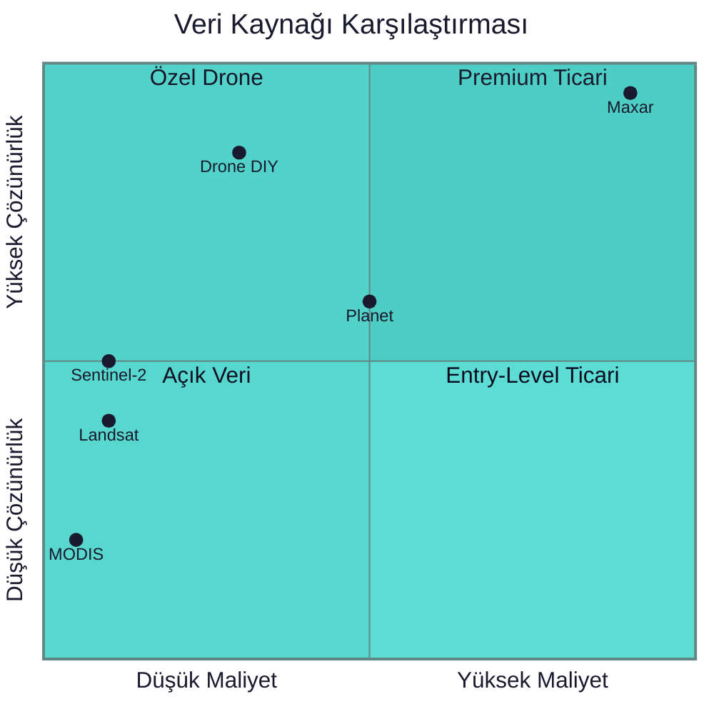
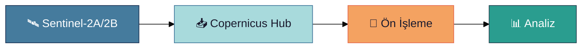
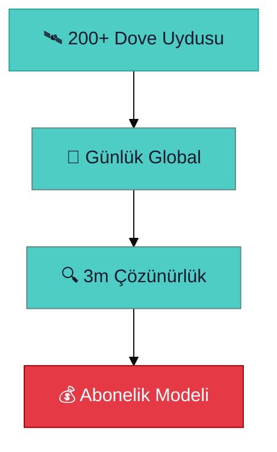
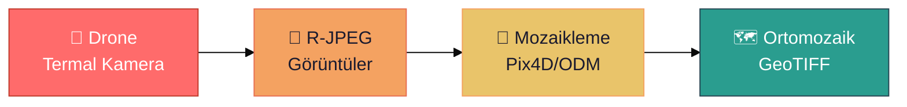
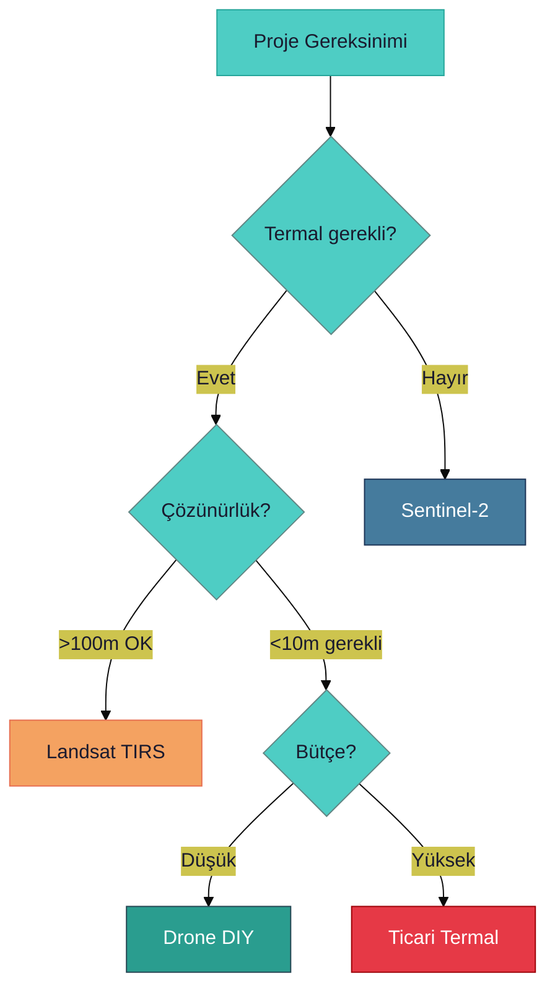

# 🛰️ Uydu Veri Kaynakları Karşılaştırması

> **"Doğru veri kaynağı seçimi, projenin başarısını belirler."**

---

## 📋 İçindekiler

- [Karşılaştırma Tablosu](#-karşılaştırma-tablosu)
- [Açık Veri Kaynakları](#-açık-veri-kaynakları)
- [Ticari Kaynaklar](#-ticari-kaynaklar)
- [Kendi Veri Toplama](#-kendi-veri-toplama)
- [Seçim Kriterleri](#-seçim-kriterleri)

---

## 📊 Karşılaştırma Tablosu

### Ana Karşılaştırma

| Kaynak | Çözünürlük | Maliyet | Termal | Temporal | API |
|--------|------------|---------|--------|----------|-----|
| **Sentinel-2** | 10m | Ücretsiz | ❌ | 5 gün | ✅ |
| **Landsat-8/9** | 30m | Ücretsiz | ✅ 100m | 16 gün | ✅ |
| **MODIS** | 250m-1km | Ücretsiz | ✅ | Günlük | ✅ |
| **Planet** | 3m | $$ | ❌ | Günlük | ✅ |
| **Maxar** | 30cm | $$$ | ⚠️ | Değişken | ✅ |
| **Drone DIY** | 1-5cm | Düşük | ✅ | İsteğe bağlı | - |

---

## 🌍 Açık Veri Kaynakları

### Sentinel-2 (ESA/Copernicus)

| Özellik | Değer |
|---------|-------|
| Çözünürlük | 10m (RGB), 20m (RedEdge), 60m (Atm) |
| Bantlar | 13 spektral bant |
| Tekrar Süresi | 5 gün (2 uydu) |
| Kapsama | Global |
| Veri Boyutu | ~1GB / tile |

**Kullanım Alanları:**
- ✅ Arazi örtüsü sınıflandırma
- ✅ Bitki sağlığı (NDVI)
- ✅ Su kütleleri izleme
- ❌ Termal analiz (bant yok)

### Landsat-8/9 (NASA/USGS)

| Özellik | Değer |
|---------|-------|
| Çözünürlük | 30m (OLI), 100m (TIRS) |
| Bantlar | 11 bant (2 termal) |
| Tekrar Süresi | 16 gün (tek), 8 gün (çift) |
| Termal Bantlar | Band 10, 11 (TIRS) |

**Termal Kullanım:**
- ✅ Yüzey sıcaklığı (LST)
- ✅ Kentsel ısı adası
- ✅ Yangın tespiti
- ⚠️ 100m çözünürlük (kaba)

### MODIS (NASA)

| Özellik | Değer |
|---------|-------|
| Çözünürlük | 250m - 1km |
| Tekrar Süresi | 1-2 gün |
| Kapsama | Global |
| Termal | ✅ Günlük LST ürünleri |

**Avantajlar:**
- ✅ Günlük veri
- ✅ Uzun zaman serisi (2000+)
- ✅ Hazır ürünler (LST, NDVI)

---

## 💰 Ticari Kaynaklar

### Planet Labs

| Özellik | Değer |
|---------|-------|
| Çözünürlük | 3-5m |
| Temporal | Günlük |
| Maliyet | ~$5-15 / km² |
| API | ✅ REST API |

### Maxar (DigitalGlobe)

| Özellik | Değer |
|---------|-------|
| Çözünürlük | 30-50cm |
| Maliyet | ~$15-25 / km² |
| Kullanım | Yüksek detay gereken projeler |

---

## 🚁 Kendi Veri Toplama

### Drone ile Termal Haritalama

| Avantaj | Dezavantaj |
|---------|------------|
| ✅ Çok yüksek çözünürlük (cm) | ❌ Sınırlı kapsama alanı |
| ✅ Istenilen zamanda | ❌ Uçuş izinleri |
| ✅ Termal detay | ❌ İşlem süresi |

---

## 🎯 Seçim Kriterleri

### Karar Ağacı

### Bu Proje İçin Öneri

| Amaç | Önerilen Kaynak |
|------|-----------------|
| Geniş alan haritası | Sentinel-2 + Landsat |
| Termal detay | Drone termal kamera |
| Günlük değişim | MODIS |

---

> 💡 **Sonraki:** [02-Data-Management/data-pipeline.md](./data-pipeline.md)
