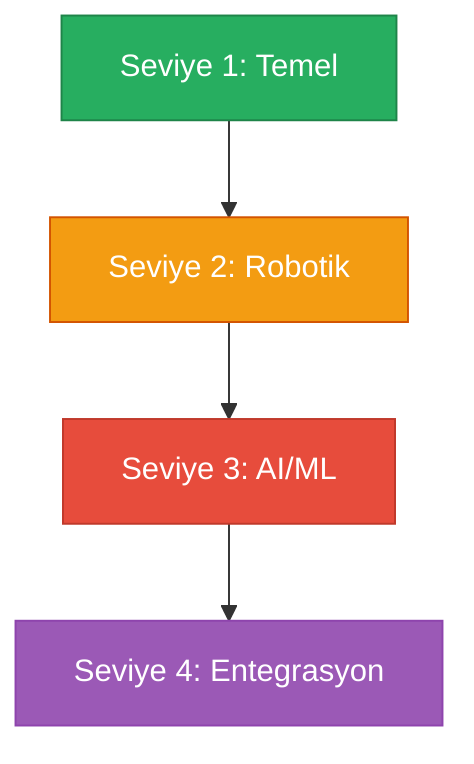
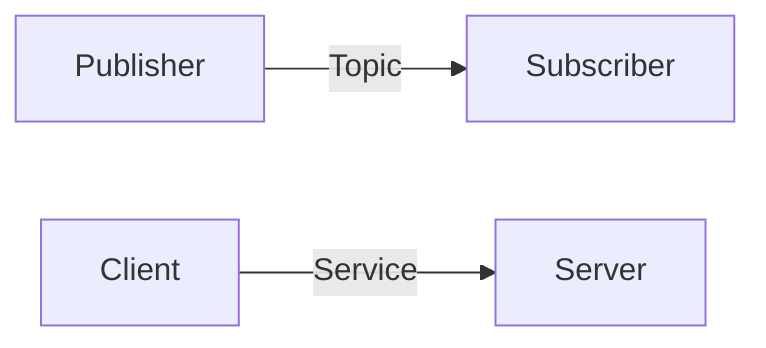
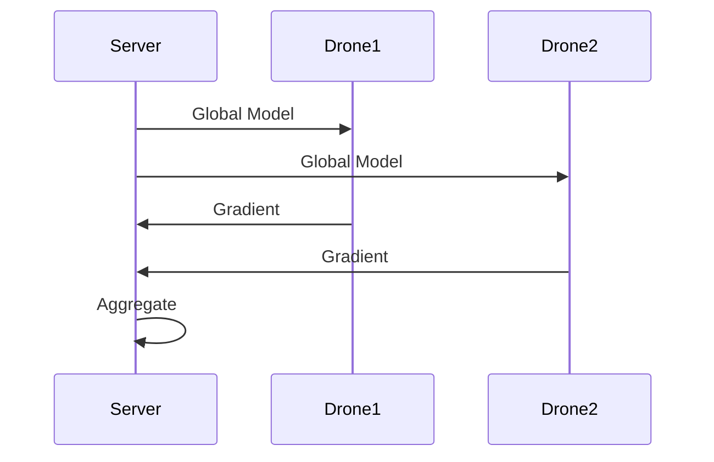
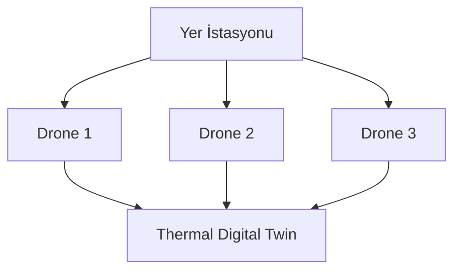

# 🎯 Temel Beceriler: Sıfırdan Edge AI Mühendisine

> **"Bir yolculuk bin adımla başlar, ama doğru adımı atmak yönü belirler."**

---

## 📋 İçindekiler

- [Öğrenme Yol Haritası](#-öğrenme-yol-haritası)
- [Seviye 1: Temel (0-2 Ay)](#-seviye-1-temel)
- [Seviye 2: Robotik Altyapı (2-4 Ay)](#-seviye-2-robotik-altyapı)
- [Seviye 3: AI/ML (4-6 Ay)](#-seviye-3-aiml)
- [Seviye 4: Entegrasyon (6-8 Ay)](#-seviye-4-entegrasyon)
- [Kaynak Kütüphanesi](#-kaynak-kütüphanesi)

---

## 🗺️ Öğrenme Yol Haritası



| Seviye | Süre | Konular | Milestone |
|--------|------|---------|-----------|
| 🟢 1 | 0-2 ay | Linux, Python, Git | İlk script |
| 🟡 2 | 2-4 ay | ROS 2, Docker, Sensörler | İlk ROS node |
| 🔴 3 | 4-6 ay | TensorRT, FL | Jetson inference |
| ⚫ 4 | 6-8 ay | Sürü koordinasyonu | Multi-drone demo |

---

## 🟢 Seviye 1: Temel

### Linux Temelleri

**Neden Ubuntu 22.04?**
- ✅ ROS 2 Humble resmi desteği
- ✅ Jetson JetPack uyumluluğu
- ✅ Geniş topluluk

#### Temel Komutlar

```bash
# Dosya sistemi
ls -la          # Dosya listele
cd /path        # Dizin değiştir
mkdir -p dir    # Dizin oluştur

# Paket yönetimi
sudo apt update
sudo apt install <paket>

# Süreç yönetimi
ps aux          # Süreçler
htop            # Sistem monitör
```

### Python Programlama

| Konu | Öncelik | Kullanım |
|------|---------|----------|
| NumPy | 🔴 Kritik | Array işlemleri |
| OpenCV | 🔴 Kritik | Görüntü işleme |
| asyncio | 🟢 Faydalı | Asenkron programlama |

```python
# OpenCV Kamera Örneği
import cv2

cap = cv2.VideoCapture(0)
while True:
    ret, frame = cap.read()
    cv2.imshow('Camera', frame)
    if cv2.waitKey(1) & 0xFF == ord('q'):
        break
cap.release()
```

### Git & GitHub

```bash
git clone <url>
git add .
git commit -m "mesaj"
git push origin main
```

### ✅ Seviye 1 Checklist

- [ ] Ubuntu 22.04 kuruldu
- [ ] Python script'ler yazılıyor
- [ ] Git temel işlemleri yapılıyor

---

## 🟡 Seviye 2: Robotik Altyapı

### ROS 2 Neden ROS 1 Değil?

| Özellik | ROS 1 | ROS 2 |
|---------|-------|-------|
| Python | 2.7 ❌ | 3.8+ ✅ |
| Real-time | ❌ | ✅ |
| Jetson | ⚠️ | ✅ Resmi |

### Temel Kavramlar



| Kavram | Açıklama |
|--------|----------|
| Node | Bağımsız program |
| Topic | Mesaj kanalı |
| Service | İstek/cevap |

### RViz ile Görselleştirme

- **PointCloud2**: RealSense 3D verisi
- **Image**: Kamera görüntüsü
- **TF**: Koordinat dönüşümleri

### Docker

```bash
docker run -it ros:humble bash
docker-compose up -d
```

### ✅ Seviye 2 Checklist

- [ ] ROS 2 Humble kuruldu
- [ ] İlk node yazıldı
- [ ] Docker container çalıştı

---

## 🔴 Seviye 3: AI/ML

### Edge AI Frameworks

| Framework | Hız | Jetson Desteği |
|-----------|-----|----------------|
| PyTorch | 1x | ✅ |
| ONNX | 1.5x | ✅ |
| **TensorRT** | **3-5x** | ✅ Native |

### Model Optimizasyonu

| Teknik | Etkisi |
|--------|--------|
| Quantization | FP32→INT8, 2-4x hız |
| Pruning | %50-90 boyut azalma |

### Federated Learning



### ✅ Seviye 3 Checklist

- [ ] TensorRT inference çalıştı
- [ ] Quantization uygulandı
- [ ] FL demo yapıldı

---

## ⚫ Seviye 4: Entegrasyon

### Sürü Koordinasyonu



### ✅ Seviye 4 Checklist

- [ ] Multi-drone simülasyonu
- [ ] Thermal Digital Twin entegrasyonu
- [ ] Uydu verisi işleme

---

## 📚 Kaynak Kütüphanesi

### Ücretsiz Kurslar

| Kurs | Platform | Dil |
|------|----------|-----|
| ROS 2 for Beginners | Udemy | EN |
| Jetson AI Certification | NVIDIA DLI | EN |
| Docker Mastery | Udemy | EN |

### Topluluklar

| Platform | Amaç |
|----------|------|
| discourse.ros.org | ROS soruları |
| forums.developer.nvidia.com | Jetson desteği |

---

> 💡 **Sonraki:** [04-Roadmap/learning-milestones.md](../04-Roadmap/learning-milestones.md)
