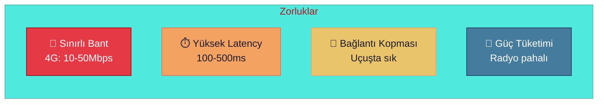
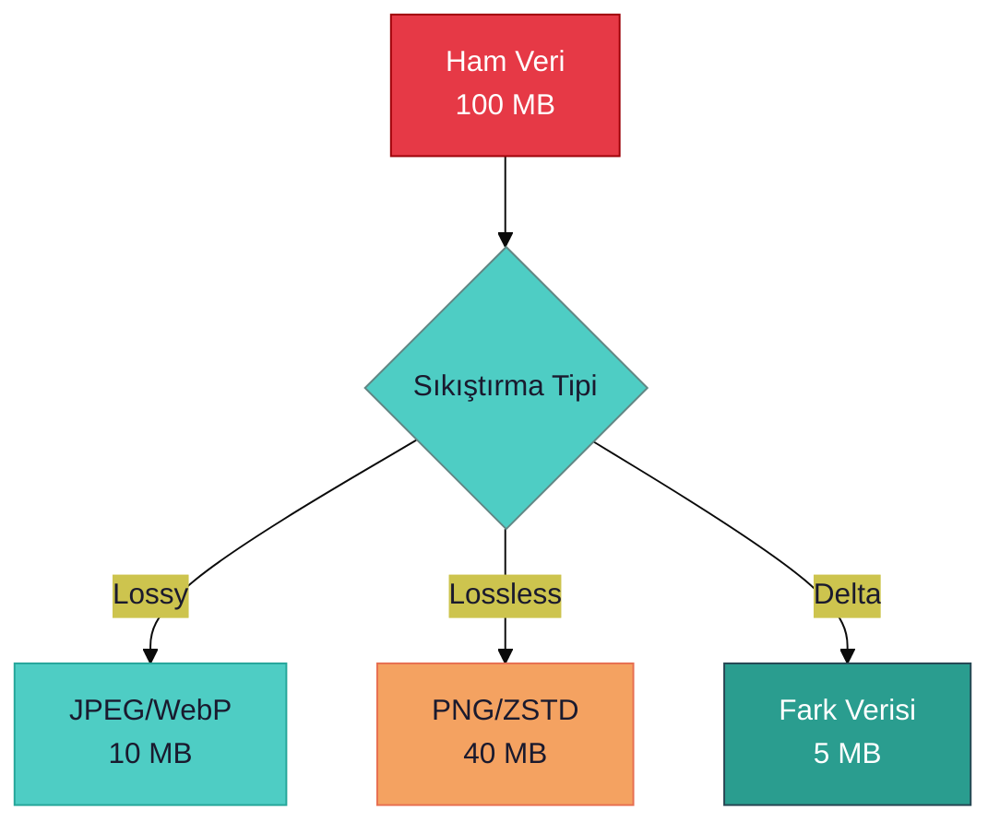
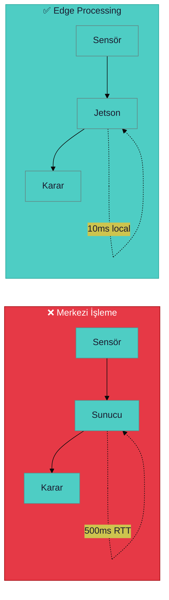
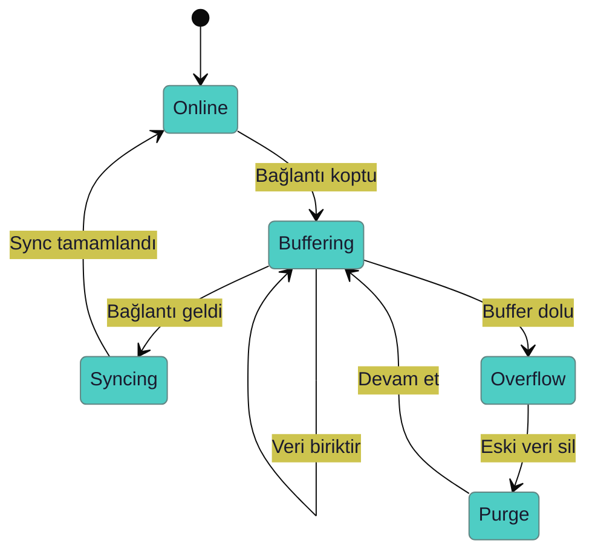

# 📡 Ağ Optimizasyonu: Sunucu-Drone İletişimi

> **"En hızlı kod, asla çalışmayan koddur - ama en hızlı veri, asla gönderilmeyen veridir."**

---

## 📋 İçindekiler

- [İletişim Zorlukları](#-iletişim-zorlukları)
- [Bant Genişliği Optimizasyonu](#-bant-genişliği-optimizasyonu)
- [Latency Azaltma](#-latency-azaltma)
- [Protokol Seçimi](#-protokol-seçimi)
- [Offline Çalışma](#-offline-çalışma)

---

## ⚠️ İletişim Zorlukları



| Zorluk | Etki | Önlem |
|--------|------|-------|
| Düşük bant genişliği | Veri gecikmesi | Sıkıştırma |
| Yüksek latency | Kontrol gecikmesi | Edge processing |
| Bağlantı kopması | Veri kaybı | Offline buffer |
| Güç tüketimi | Uçuş süresi kısalır | Batch gönderim |

---

## 📦 Bant Genişliği Optimizasyonu

### Veri Sıkıştırma Stratejileri



| Strateji | Oran | Kalite Kaybı | Kullanım |
|----------|------|--------------|----------|
| JPEG (Q80) | 10:1 | ⚠️ Az | RGB görüntü |
| WebP | 15:1 | ⚠️ Az | Modern sistem |
| ZSTD | 3:1 | ✅ Yok | Termal veri |
| Delta | 20:1 | ✅ Yok | Ardışık frame |

### Örnek: Delta Encoding

```python
import numpy as np
import zstandard as zstd

def delta_encode(current: np.ndarray, previous: np.ndarray) -> bytes:
    """
    İki frame arasındaki farkı sıkıştır.
    """
    delta = current.astype(np.int16) - previous.astype(np.int16)
    
    # ZSTD ile sıkıştır
    cctx = zstd.ZstdCompressor(level=3)
    compressed = cctx.compress(delta.tobytes())
    
    return compressed
```

---

## ⚡ Latency Azaltma

### Edge Processing



| İşlem | Merkezi | Edge |
|-------|---------|------|
| Nesne tespiti | 500-1000ms | 30-50ms |
| Engel kaçınma | 300-500ms | 10-20ms |
| Yol planlama | 200-400ms | 50-100ms |

### Kritik vs Non-Kritik Ayrımı

| Veri | Kritiklik | Latency Limit | Öncelik |
|------|-----------|---------------|---------|
| Acil dur komutu | 🔴 Kritik | <100ms | Yüksek |
| Telemetri | 🟡 Önemli | <500ms | Orta |
| Görüntü stream | 🟢 Normal | <2s | Düşük |
| FL gradient | 🟢 Normal | <5s | Düşük |

---

## 📡 Protokol Seçimi

### Protokol Karşılaştırması

| Protokol | Latency | Overhead | Güvenilirlik | Kullanım |
|----------|---------|----------|--------------|----------|
| **UDP** | Düşük | Düşük | ❌ | Telemetri |
| **TCP** | Orta | Orta | ✅ | Dosya transfer |
| **MQTT** | Düşük | Düşük | ⚠️ QoS | IoT mesaj |
| **WebSocket** | Orta | Düşük | ✅ | Real-time |
| **MAVLink** | Düşük | Düşük | ⚠️ | Uçuş kontrol |

### MQTT Konfigürasyonu

```python
import paho.mqtt.client as mqtt

client = mqtt.Client()
client.connect("broker.server.com", 1883)

# QoS seviyeleri
# 0: At most once (en hızlı, kayıp olabilir)
# 1: At least once (tekrar olabilir)
# 2: Exactly once (en yavaş, garantili)

# Telemetri için QoS 0
client.publish("drone/1/telemetry", payload, qos=0)

# Komut için QoS 1
client.publish("drone/1/command", payload, qos=1)
```

---

## 📴 Offline Çalışma

### Buffer Stratejisi



### Öncelik Tabanlı Buffer

| Öncelik | Veri Tipi | Buffer Süresi | Overflow |
|---------|-----------|---------------|----------|
| 1 | Kritik telemetri | Sınırsız | Asla sil |
| 2 | Termal anomali | 1 saat | FIFO |
| 3 | Video frame | 5 dakika | Düşük kalite |
| 4 | Debug log | 10 dakika | Sil |

---

## ✅ Optimizasyon Checklist

- [ ] Delta encoding aktif
- [ ] ZSTD sıkıştırma açık
- [ ] Edge inference çalışıyor
- [ ] MQTT QoS ayarlandı
- [ ] Offline buffer test edildi

---

> 💡 **Sonraki:** [05-Simulation/gazebo-to-real-transition.md](../05-Simulation/gazebo-to-real-transition.md)
