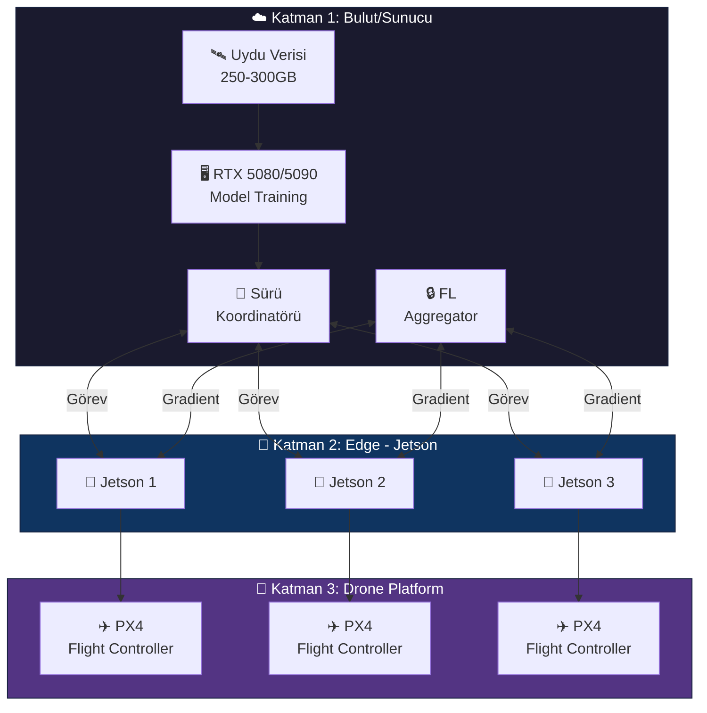
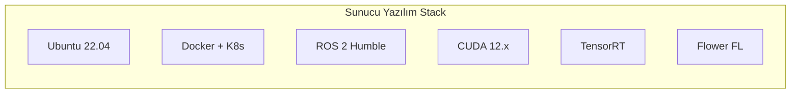
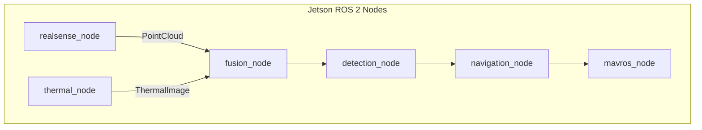
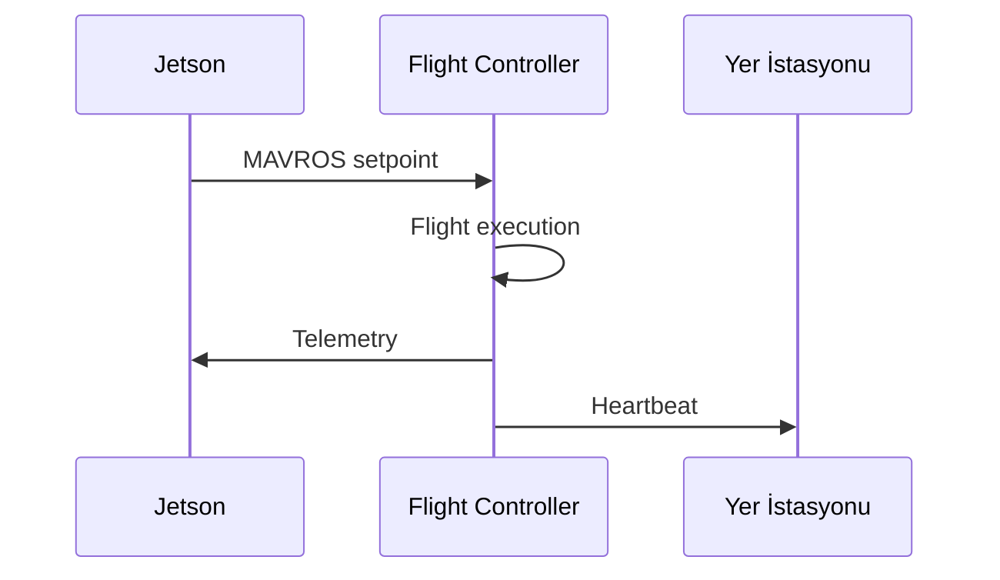
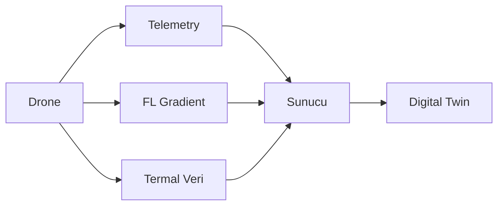
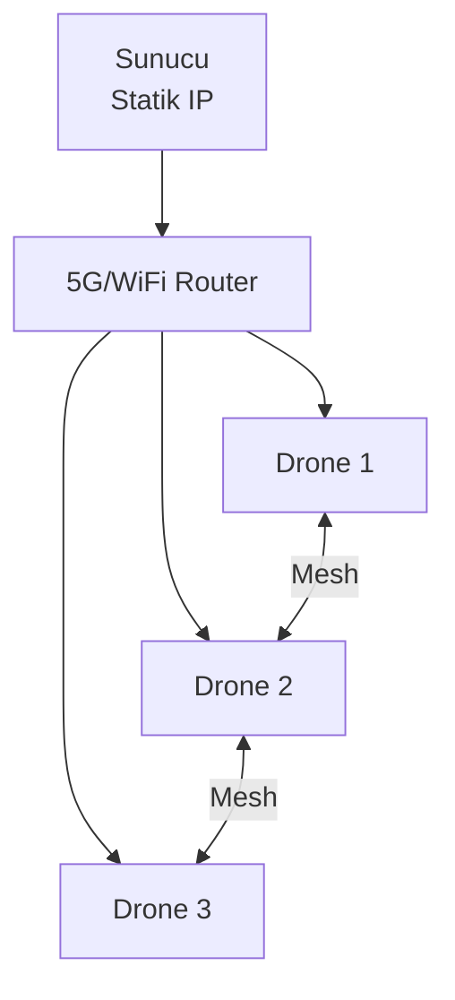

# 🏗️ Sunucu-Drone Mimarisi: Merkezi Koordinasyon Sistemi

> **"Tek bir karınca değil, koloni başarır."** - Bu prensip, sunucu-drone mimarimizin temelidir.

---

## 📋 İçindekiler

- [Mimari Genel Bakış](#-mimari-genel-bakış)
- [Katman 1: Bulut/Sunucu](#️-katman-1-bulutsunucu)
- [Katman 2: Edge (Jetson)](#-katman-2-edge-jetson)
- [Katman 3: Drone Platform](#-katman-3-drone-platform)
- [Veri Akışı](#-veri-akışı)
- [İletişim Protokolleri](#-iletişim-protokolleri)

---

## 🌐 Mimari Genel Bakış

---

## 🖥️ Katman 1: Bulut/Sunucu

### Donanım Spesifikasyonu

| Bileşen | Spesifikasyon | Görev |
|---------|---------------|-------|
| **GPU** | RTX 5080/5090 | Model eğitimi, veri işleme |
| **CPU** | AMD EPYC / Intel Xeon | ETL, koordinasyon |
| **RAM** | 128-256 GB DDR5 | Büyük veri setleri |
| **Storage** | NVMe RAID | 250-300GB uydu verisi |
| **Network** | 10Gbps | Hızlı veri transferi |

### Yazılım Bileşenleri

| Bileşen | Sürüm | Rol |
|---------|-------|-----|
| Ubuntu Server | 22.04 LTS | Ana OS |
| Docker | 24.x | Container runtime |
| ROS 2 | Humble | Robot middleware |
| CUDA | 12.x | GPU computing |
| TensorRT | 8.6+ | Inference optimization |
| Flower | 1.x | Federated Learning |

### Sunucu Görevleri

1. **Uydu Verisi İşleme**
   - 250-300GB ham veri alımı
   - GeoTIFF → COG dönüşümü
   - Tile generation

2. **Model Eğitimi**
   - Termal anomali detection
   - Object detection models
   - Global model maintenance

3. **Sürü Koordinasyonu**
   - Görev dağıtımı
   - Bölge optimizasyonu
   - Çakışma önleme

4. **Federated Learning Aggregation**
   - Gradient toplama
   - Model güncellemesi
   - Edge dağıtımı

---

## 📡 Katman 2: Edge (Jetson)

### Her Jetson Orin Nano

| Görev | Açıklama |
|-------|----------|
| **Real-time Inference** | TensorRT ile nesne tespiti |
| **Sensör Füzyonu** | RealSense + Termal birleştirme |
| **Lokal Karar** | Engel kaçınma, yol planlama |
| **FL Local Training** | Lokal veriyle model güncelleme |

### ROS 2 Node Yapısı

---

## 🚁 Katman 3: Drone Platform

### Uçuş Kontrolü

| Bileşen | Seçenek | Açıklama |
|---------|---------|----------|
| **Firmware** | PX4 / ArduPilot | Otonom uçuş |
| **Protocol** | MAVLink | Komut iletişimi |
| **Companion** | Jetson Orin Nano | AI partner |

### MAVLink İletişimi

---

## 🔄 Veri Akışı

### Aşağı Akış (Sunucu → Drone)

1. Uydu verisi işlenir (250GB → 500MB görev)
2. Görev koordinatları belirlenir
3. Tile'lar hazırlanır
4. Drone'lara dağıtılır

### Yukarı Akış (Drone → Sunucu)

1. Telemetri (konum, durum)
2. FL gradient'ları
3. Termal tarama sonuçları
4. Digital Twin güncelleme

---

## 📡 İletişim Protokolleri

### Protokol Seçimi

| Protokol | Kullanım | Bant Genişliği |
|----------|----------|----------------|
| **MQTT** | Telemetry | Düşük |
| **DDS** | ROS 2 | Orta |
| **HTTP/2** | Veri transfer | Yüksek |
| **MAVLink** | Uçuş komutları | Düşük |

### Ağ Topolojisi

### Latency Gereksinimleri

| İşlem | Max Latency | Kritiklik |
|-------|-------------|-----------|
| Acil dur | <100ms | 🔴 Kritik |
| Navigasyon | <500ms | 🟡 Önemli |
| Telemetry | <1000ms | 🟢 Normal |
| FL Sync | <5000ms | 🟢 Normal |

---

## 🔧 Kurulum Checklist

- [ ] Sunucu Ubuntu 22.04 + CUDA kuruldu
- [ ] Docker + ROS 2 container hazır
- [ ] Jetson JetPack 6.0 kuruldu
- [ ] PX4 SITL simülasyonu çalışıyor
- [ ] MAVLink bağlantısı test edildi

---

> 💡 **Sonraki:** [04-Roadmap/project-timeline.md](../04-Roadmap/project-timeline.md)
