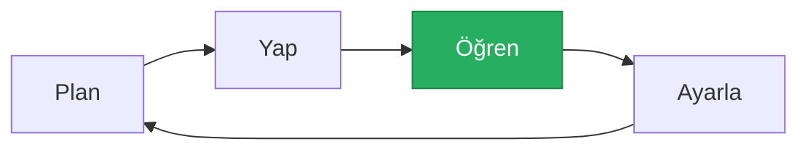
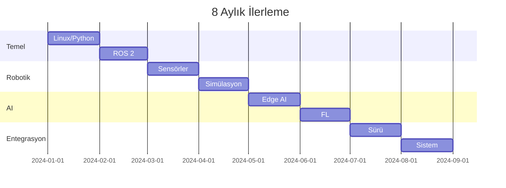

# 🎯 Öğrenme Milestone'ları: İteratif Geliştirme Yaklaşımı

> **"Hedef belirle, ölç, ayarla, tekrarla."**

---

## 📋 İçindekiler

- [Yaklaşım Felsefesi](#-yaklaşım-felsefesi)
- [Aylık Milestone'lar](#-aylık-milestonelar)
- [Değerlendirme Kriterleri](#-değerlendirme-kriterleri)
- [İlerleme Takibi](#-ilerleme-takibi)

---

## 🔄 Yaklaşım Felsefesi

Bu proje akademik deadline'a bağlı olmadığı için:

| Geleneksel | Bu Proje |
|------------|----------|
| Sabit deadline | Esnek milestone |
| Pass/Fail | Sürekli ilerleme |
| Final teslim | İteratif demo |
| Başarısızlık = Kayıp | Başarısızlık = Veri |

---

## 📅 Aylık Milestone'lar

### Ay 1: Linux & Python Temelleri

**Hedef:** Geliştirme ortamını kurma

| Görev | Ölçüt | Durum |
|-------|-------|-------|
| Ubuntu kurulum | Önyükleme başarılı | ⬜ |
| Terminal rahatlığı | 10 temel komut | ⬜ |
| Python script | Kamera okuma | ⬜ |
| Git repo | İlk push | ⬜ |

**Demo:** Terminal'de basit video işleme

---

### Ay 2: ROS 2 Başlangıç

**Hedef:** İlk ROS 2 node'u

| Görev | Ölçüt | Durum |
|-------|-------|-------|
| ROS 2 kurulum | `ros2 run` çalışıyor | ⬜ |
| Publisher/Subscriber | Mesaj iletimi | ⬜ |
| RViz görselleştirme | Topic görüntüleme | ⬜ |

**Demo:** Kamera topic'i RViz'de

---

### Ay 3: Sensör Entegrasyonu

**Hedef:** RealSense + Termal entegrasyonu

| Görev | Ölçüt | Durum |
|-------|-------|-------|
| RealSense SDK | Derinlik görüntüsü | ⬜ |
| PointCloud | 3D veri ROS'ta | ⬜ |
| Termal kamera | Bağlantı test | ⬜ |

**Demo:** Termal + derinlik görselleştirme

---

### Ay 4: Simülasyon Ortamı

**Hedef:** İlk simülasyon uçuşu

| Görev | Ölçüt | Durum |
|-------|-------|-------|
| Gazebo kurulum | Dünya yüklendi | ⬜ |
| PX4 SITL | Takeoff/land | ⬜ |
| Waypoint | Otomatik rota | ⬜ |

**Demo:** Simüle drone waypoint takibi

---

### Ay 5: Edge AI

**Hedef:** Jetson üzerinde inference

| Görev | Ölçüt | Durum |
|-------|-------|-------|
| ONNX export | Model dönüştürme | ⬜ |
| TensorRT | Optimizasyon | ⬜ |
| Gerçek zamanlı | 15+ FPS | ⬜ |

**Demo:** Jetson'da nesne tespiti

---

### Ay 6: Federated Learning

**Hedef:** FL demo

| Görev | Ölçüt | Durum |
|-------|-------|-------|
| Flower kurulum | Server/client | ⬜ |
| Lokal training | 1 round | ⬜ |
| Aggregation | Merged model | ⬜ |

**Demo:** 2 client FL round

---

### Ay 7: Sürü Koordinasyonu

**Hedef:** Multi-drone simülasyonu

| Görev | Ölçüt | Durum |
|-------|-------|-------|
| 3 drone spawn | Paralel uçuş | ⬜ |
| Bölge paylaşımı | Çakışma yok | ⬜ |
| Merkezi kontrol | GCS iletişimi | ⬜ |

**Demo:** 3 drone alan taraması

---

### Ay 8: Entegrasyon

**Hedef:** Tam sistem demo

| Görev | Ölçüt | Durum |
|-------|-------|-------|
| Digital Twin | Termal harita | ⬜ |
| FL aktif | Model güncelleme | ⬜ |
| End-to-end | Uydu → Drone | ⬜ |

**Demo:** Thermal Digital Twin + Swarm

---

## 📊 Değerlendirme Kriterleri

### Her Milestone İçin

| Kriter | Puan | Açıklama |
|--------|------|----------|
| Tamamlandı | 3 | Hedef gerçekleşti |
| Kısmen | 2 | %50+ ilerleme |
| Başlanmadı | 0 | Henüz yok |
| Pivot | 1 | Yön değişikliği |

---

## 📈 İlerleme Takibi

---

> 💡 **Sonraki:** [05-Simulation/simulation-setup.md](../05-Simulation/simulation-setup.md)
