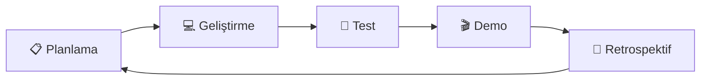
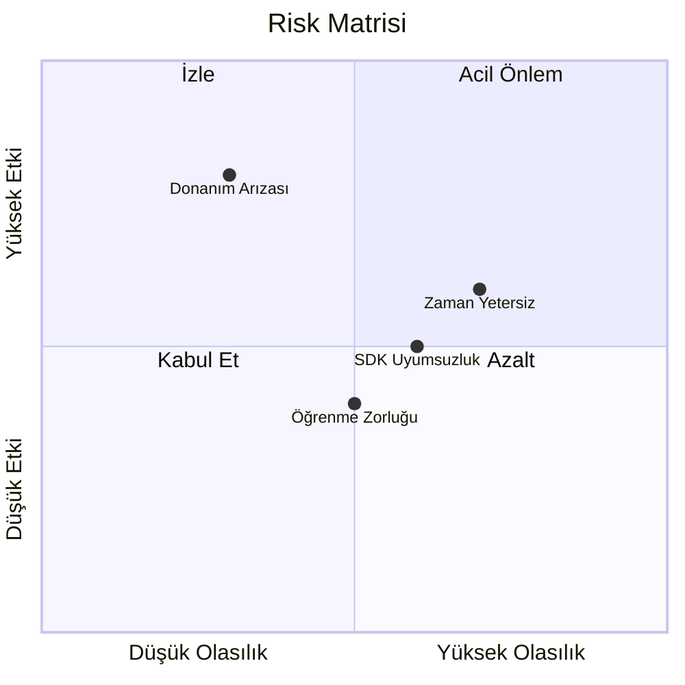

# 📅 Proje Zaman Çizelgesi

> **"Plan yapmayan, başarısızlığı planlıyor."** - Benjamin Franklin

---

## 📋 İçindekiler

- [Gantt Diyagramı](#-gantt-diyagramı)
- [Sprint Planlaması](#-sprint-planlaması)
- [Kaynak Kısıtlamaları](#-kaynak-kısıtlamaları)
- [Risk Yönetimi](#-risk-yönetimi)

---

## 📊 Gantt Diyagramı

```mermaid
gantt
    title Drone Projesi - 8 Aylık Timeline
    dateFormat YYYY-MM-DD
    
    section Temel Eğitim
    Linux & Terminal        :a1, 2024-01-01, 2w
    Python & NumPy          :a2, after a1, 2w
    Git & GitHub           :a3, after a2, 1w
    OpenCV Temelleri       :a4, after a3, 1w
    
    section ROS 2 & Robotik
    ROS 2 Kurulum          :b1, 2024-02-01, 1w
    Nodes & Topics         :b2, after b1, 2w
    Launch Files           :b3, after b2, 1w
    RViz Görselleştirme    :b4, after b3, 1w
    
    section Sensör Entegrasyonu
    RealSense SDK          :c1, 2024-03-01, 2w
    PointCloud İşleme      :c2, after c1, 2w
    Termal Kamera          :c3, after c2, 2w
    Sensör Füzyonu         :c4, after c3, 2w
    
    section Simülasyon
    Gazebo Kurulum         :d1, 2024-04-15, 1w
    PX4 SITL               :d2, after d1, 1w
    Waypoint Navigasyon    :d3, after d2, 2w
    
    section AI/ML
    ONNX Export            :e1, 2024-05-01, 1w
    TensorRT               :e2, after e1, 2w
    Edge Deployment        :e3, after e2, 2w
    FL Demo                :e4, 2024-06-01, 3w
    
    section Entegrasyon
    Multi-Drone            :f1, 2024-07-01, 3w
    Digital Twin           :f2, after f1, 2w
    Final Demo             :f3, after f2, 2w
    
    section Milestone
    M1: İlk Script         :milestone, m1, 2024-01-31, 0d
    M2: İlk ROS Node       :milestone, m2, 2024-02-28, 0d
    M3: Sensör Demo        :milestone, m3, 2024-03-31, 0d
    M4: Simülasyon Uçuş    :milestone, m4, 2024-04-30, 0d
    M5: Edge AI            :milestone, m5, 2024-05-31, 0d
    M6: FL Round           :milestone, m6, 2024-06-30, 0d
    M7: Swarm Demo         :milestone, m7, 2024-07-31, 0d
    M8: Final              :milestone, m8, 2024-08-31, 0d
```

---

## 🏃 Sprint Planlaması

### Sprint Yapısı

| Öge | Değer |
|-----|-------|
| Sprint süresi | 2 hafta |
| Planlama | Sprint başı (Pazartesi) |
| Demo | Sprint sonu (Cuma) |
| Retro | Demo sonrası |

### Sprint Örneği



---

## ⚠️ Kaynak Kısıtlamaları

### Donanım Erişimi

| Kaynak | Durum | Alternatif |
|--------|-------|------------|
| RTX 5080/5090 | ⚠️ Pahalı | Google Colab Pro |
| Jetson Orin Nano | ✅ Var | - |
| RealSense D455 | ✅ Var | - |
| Termal Kamera | ✅ Var | - |
| Fiziksel Drone | ❌ Henüz yok | SITL simülasyonu |

### Sunucu Alternatifleri

| Senaryo | Çözüm |
|---------|-------|
| GPU yok | Google Colab / Kaggle |
| Cloud | AWS EC2 g4dn |
| Üniversite | Lab sunucuları |

---

## 🚨 Risk Yönetimi



### Risk Tablosu

| Risk | Olasılık | Etki | Önlem |
|------|----------|------|-------|
| Jetson arıza | Düşük | Yüksek | Yedek cihaz |
| ROS 2 güncelleme | Orta | Orta | Version lock |
| Zaman yetersiz | Yüksek | Orta | Scope azaltma |
| API değişikliği | Orta | Orta | Dokümantasyon |

---

## 📆 Demo Günleri

| Tarih | Demo | Hedef Kitle |
|-------|------|-------------|
| Ocak sonu | Terminal + Python | Self-assessment |
| Şubat sonu | ROS 2 nodes | Mentor review |
| Mart sonu | Sensör entegrasyonu | Takım |
| Nisan sonu | Simülasyon uçuşu | Demo day |
| Mayıs sonu | Edge AI | Teknik review |
| Haziran sonu | FL demo | Akademik |
| Temmuz sonu | Swarm | Prototip |
| Ağustos sonu | Final | Showcase |

---

> 💡 **Sonraki:** [05-Simulation/simulation-setup.md](../05-Simulation/simulation-setup.md)
