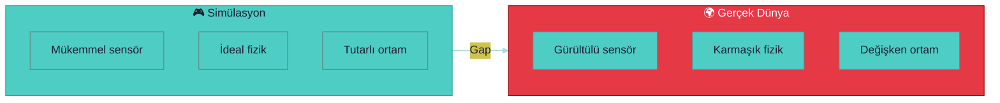
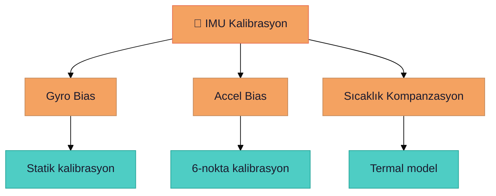
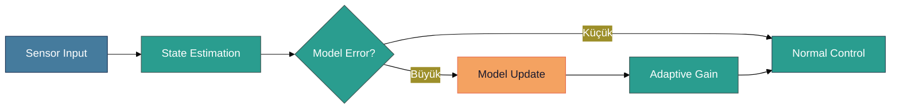
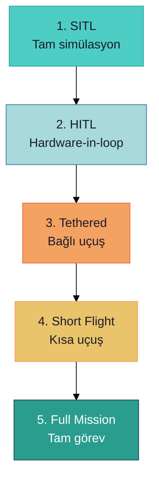

# 🔄 Simülasyondan Gerçeğe Geçiş

> **"Simülasyonda her şey mükemmel çalışır - gerçek dünya çok daha ilginç."**

---

## 📋 İçindekiler

- [Sim2Real Gap](#-sim2real-gap)
- [Sensör Kalibrasyon Farkları](#-sensör-kalibrasyon-farkları)
- [Fizik Farklılıkları](#-fizik-farklılıkları)
- [Geçiş Protokolü](#-geçiş-protokolü)
- [İlk Uçuş Checklist](#-ilk-uçuş-checklist)

---

## 🌉 Sim2Real Gap



| Simülasyon | Gerçek Dünya |
|------------|--------------|
| ✅ Sensör gürültüsü yok | ⚠️ Her sensör gürültülü |
| ✅ Mükemmel GPS | ⚠️ GPS drift, multipath |
| ✅ Sabit rüzgar | ⚠️ Türbülans, ani rüzgar |
| ✅ Aynı ışık | ⚠️ Gölge, parlama |

---

## 📡 Sensör Kalibrasyon Farkları

### IMU Kalibrasyonu



| Parametre | Simülasyon | Gerçek | Etki |
|-----------|------------|--------|------|
| Gyro bias | 0 | ±0.5 °/s | Drift |
| Accel bias | 0 | ±0.1 m/s² | Yükseklik hatası |
| Noise | Minimal | Yüksek | Titreme |

### Kamera Kalibrasyonu

```bash
# RealSense kalibrasyon kontrolü
rs-enumerate-devices --calib

# İç parametreler (intrinsics)
# - Focal length (fx, fy)
# - Principal point (cx, cy)
# - Distortion coefficients (k1, k2, p1, p2)
```

---

## 🌬️ Fizik Farklılıkları

### Aerodinamik

| Faktör | Simülasyon | Gerçek Dünya |
|--------|------------|--------------|
| Rüzgar | Sabit vektör | Türbülanslı, değişken |
| Ground effect | Basit model | Karmaşık |
| Prop wash | Yok | Önemli |
| Batarya ağırlık | Sabit | Düşüyor |

### Adaptif Kontrol



---

## 📋 Geçiş Protokolü

### Aşamalı Yaklaşım



| Aşama | Açıklama | Süre | Risk |
|-------|----------|------|------|
| SITL | Tam simülasyon | - | Sıfır |
| HITL | Gerçek FCU, simüle sensör | 2 saat | Düşük |
| Tethered | İp bağlı, kısa uçuş | 30 dk | Orta |
| Short Flight | 1-2m yükseklik | 5 dk | Orta |
| Full Mission | Tam otonom | - | Yüksek |

---

## ✅ İlk Uçuş Checklist

### Pre-Flight

- [ ] Batarya %100 şarjlı
- [ ] Tüm vidalar sıkı
- [ ] Prop'lar hasarsız
- [ ] GPS lock (min 10 uydu)
- [ ] Compass calibrated
- [ ] RC bağlantısı test
- [ ] Failsafe ayarları kontrol
- [ ] Acil dur butonu hazır

### Ortam Kontrolü

- [ ] Rüzgar < 5 m/s
- [ ] Güneşli/bulutlu (yağmur yok)
- [ ] Açık alan (engel yok)
- [ ] İzin var (SHGM)
- [ ] Gözlemci hazır

### İlk Kalkış

1. **Arm** - Motorları aç (yerde)
2. **Throttle %10** - Motor dönüşü kontrol
3. **Kalkış** - Yavaşça 0.5m
4. **Hover** - 10 saniye bekle
5. **Yaw test** - Sağa/sola dön
6. **Pitch/Roll** - Hafif hareket
7. **İniş** - Yavaşça indir

### Acil Durumlar

| Durum | Eylem |
|-------|-------|
| ⚠️ Titreme | Hemen iniş |
| ⚠️ Drift | RTH aktif |
| 🔴 Motor arıza | Acil iniş |
| 🔴 Batarya kritik | Anında iniş |

---

> 💡 **Sonraki:** [05-Simulation/hardware-testing-protocol.md](./hardware-testing-protocol.md)
