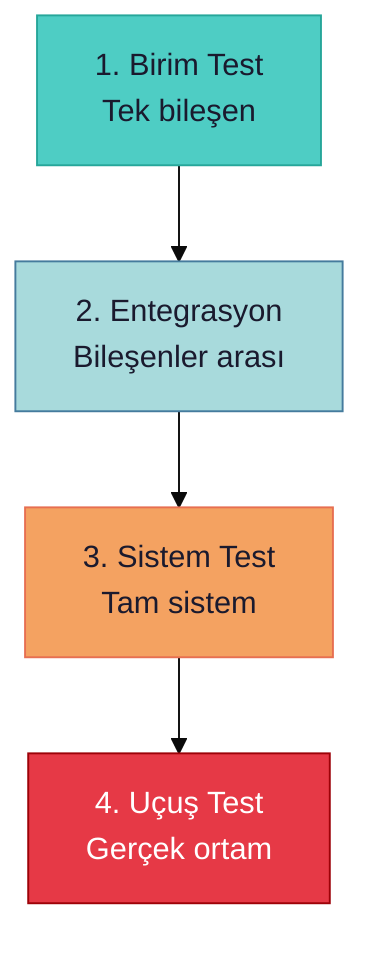
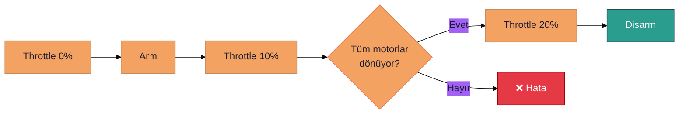

# 🧪 Donanım Test Protokolü

> **"Test etmeden uçmak, paraşütsüz atlamaktır."**

---

## 📋 İçindekiler

- [Test Seviyeleri](#-test-seviyeleri)
- [Sensör Testleri](#-sensör-testleri)
- [Motor ve ESC Testleri](#-motor-ve-esc-testleri)
- [Entegrasyon Testleri](#-entegrasyon-testleri)
- [Test Kayıt Formu](#-test-kayıt-formu)

---

## 🎯 Test Seviyeleri



| Seviye | Kapsam | Süre | Risk |
|--------|--------|------|------|
| Birim | Tek sensör/motor | 15 dk | Düşük |
| Entegrasyon | 2+ bileşen | 30 dk | Orta |
| Sistem | Tüm sistem | 1 saat | Orta |
| Uçuş | Gerçek uçuş | 5-15 dk | Yüksek |

---

## 📡 Sensör Testleri

### RealSense D455 Test

```bash
# 1. Bağlantı kontrolü
lsusb | grep Intel

# 2. Firmware sürümü
rs-enumerate-devices --terse

# 3. Stream testi
rs-capture
```

| Test | Beklenen | Pass Kriteri |
|------|----------|--------------|
| USB tanıma | Device listed | ✅ |
| Depth stream | 640x480@30fps | 25+ fps |
| RGB stream | 1280x720@30fps | 25+ fps |
| PointCloud | Valid points | >90% valid |

### Termal Kamera Test

| Test | Komut/Yöntem | Pass Kriteri |
|------|--------------|--------------|
| Bağlantı | `lsusb` | Görünür |
| Görüntü | Test yazılımı | 25 fps |
| Sıcaklık | Bilinen kaynak | ±2°C |

### IMU Test

```bash
# ROS 2 ile IMU kontrolü
ros2 topic echo /imu/data
```

| Parametre | Beklenen | Tolerans |
|-----------|----------|----------|
| Gyro (statik) | 0, 0, 0 | ±0.1 °/s |
| Accel (statik) | 0, 0, 9.8 | ±0.2 m/s² |
| Noise floor | Düşük | Std < 0.01 |

---

## ⚡ Motor ve ESC Testleri

### Motor Spin Test



### Motor Test Checklist

- [ ] Motor 1 (Sağ ön) - CW
- [ ] Motor 2 (Sol ön) - CCW  
- [ ] Motor 3 (Sol arka) - CW
- [ ] Motor 4 (Sağ arka) - CCW
- [ ] Titreme yok
- [ ] Abnormal ses yok

### ESC Kalibrasyonu

```
1. Bataryayı çıkar
2. Throttle MAX yap
3. Batarya tak
4. Bip sesini bekle (2x)
5. Throttle MIN yap
6. Bip sesini bekle (3x)
7. Kalibrasyon tamam
```

---

## 🔗 Entegrasyon Testleri

### Jetson + RealSense

```python
#!/usr/bin/env python3
"""test_realsense_ros.py"""

import rclpy
from rclpy.node import Node
from sensor_msgs.msg import Image, PointCloud2

class SensorTest(Node):
    def __init__(self):
        super().__init__('sensor_test')
        
        self.depth_count = 0
        self.rgb_count = 0
        
        self.create_subscription(
            Image, '/camera/depth/image_rect_raw',
            self.depth_cb, 10)
        self.create_subscription(
            Image, '/camera/color/image_raw',
            self.rgb_cb, 10)
        
        self.create_timer(5.0, self.report)
    
    def depth_cb(self, msg): self.depth_count += 1
    def rgb_cb(self, msg): self.rgb_count += 1
    
    def report(self):
        print(f"Depth: {self.depth_count/5:.1f} fps")
        print(f"RGB: {self.rgb_count/5:.1f} fps")
        self.depth_count = self.rgb_count = 0
```

### Full System Test

| Test | Bileşenler | Süre | Kriter |
|------|------------|------|--------|
| Sensör fusion | RS + Termal + IMU | 10 dk | Data sync |
| SLAM | RS + VSLAM | 15 dk | Map build |
| Detection | Jetson + Kamera | 10 dk | 15+ fps |
| Telemetry | All + MAVLink | 10 dk | No drops |

---

## 📝 Test Kayıt Formu

```markdown
## Test Raporu

**Tarih:** YYYY-MM-DD
**Tester:** İsim
**Donanım:** Drone ID

### Sensör Testleri
| Sensör | Sonuç | Not |
|--------|-------|-----|
| RealSense | ✅/❌ | ... |
| Termal | ✅/❌ | ... |
| IMU | ✅/❌ | ... |

### Motor Testleri
| Motor | Dönüş | Titreme | Not |
|-------|-------|---------|-----|
| M1 | CW ✅/❌ | ✅/❌ | ... |
| M2 | CCW ✅/❌ | ✅/❌ | ... |
| M3 | CW ✅/❌ | ✅/❌ | ... |
| M4 | CCW ✅/❌ | ✅/❌ | ... |

### Genel Durum
- [ ] Tüm testler geçti
- [ ] Uçuşa hazır

**İmza:** _______________
```

---

> 💡 **Sonraki:** [08-Team-Collaboration/roles-responsibilities.md](../08-Team-Collaboration/roles-responsibilities.md)
