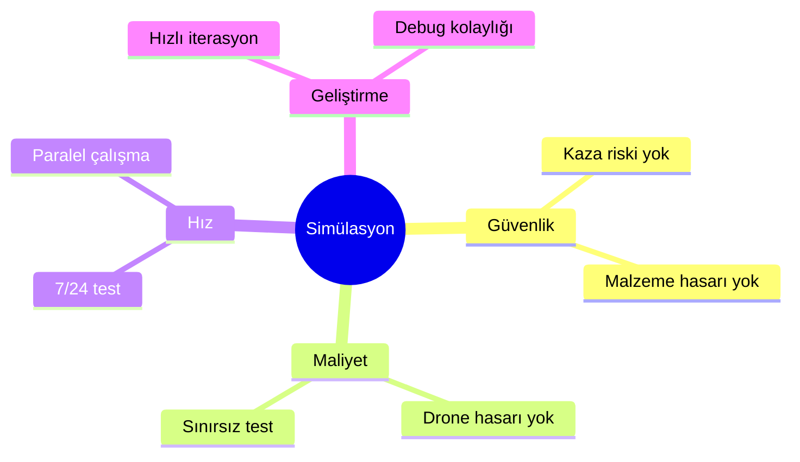
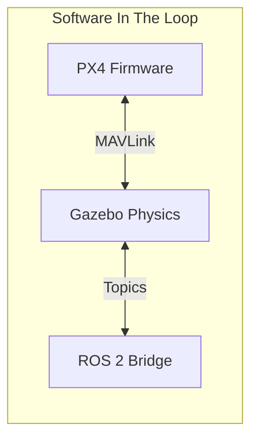
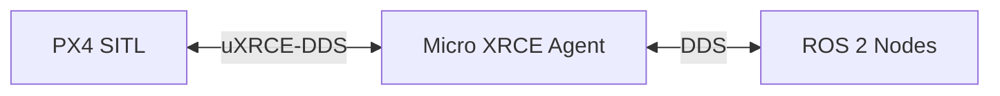
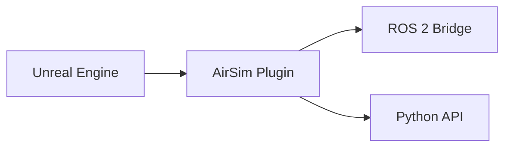

# 🎮 Simülasyon Ortamı: Gazebo & PX4 SITL

> **"Simülasyonda düşmek bedava, gerçekte pahalı."**

---

## 📋 İçindekiler

- [Neden Simülasyon?](#-neden-simülasyon)
- [Gazebo Ignition Kurulumu](#-gazebo-ignition-kurulumu)
- [PX4 SITL Konfigürasyonu](#-px4-sitl-konfigürasyonu)
- [ROS 2 Entegrasyonu](#-ros-2-entegrasyonu)
- [Alternatif Simülatörler](#-alternatif-simülatörler)

---

## 🎯 Neden Simülasyon?



| Gerçek Dünya | Simülasyon |
|--------------|------------|
| Drone kırılabilir | Sınırsız crash |
| Hava koşulları | Kontrollü ortam |
| Sınırlı pil | Süresiz uçuş |
| Yasal izinler | İzin gereksiz |

---

## 🔧 Gazebo Ignition Kurulumu

### Sürüm Seçimi

| Sürüm | ROS 2 | Durum |
|-------|-------|-------|
| **Fortress** | Humble | ✅ LTS |
| Garden | Humble/Iron | ⚠️ Yeni |
| Harmonic | Iron/Jazzy | 🔜 Gelecek |

### Ubuntu 22.04 Kurulum

```bash
# Gazebo Fortress kurulumu
sudo apt update
sudo apt install lsb-release curl gnupg

# Anahtar ekleme
sudo curl https://packages.osrfoundation.org/gazebo.gpg \
  --output /usr/share/keyrings/pkgs-osrf-archive-keyring.gpg

# Repo ekleme
echo "deb [arch=$(dpkg --print-architecture) \
  signed-by=/usr/share/keyrings/pkgs-osrf-archive-keyring.gpg] \
  https://packages.osrfoundation.org/gazebo/ubuntu-stable \
  $(lsb_release -cs) main" | \
  sudo tee /etc/apt/sources.list.d/gazebo-stable.list > /dev/null

# Kurulum
sudo apt update
sudo apt install ignition-fortress

# Test
ign gazebo shapes.sdf
```

### Basit Dünya Oluşturma

```xml
<?xml version="1.0" ?>
<sdf version="1.8">
  <world name="drone_world">
    <!-- Güneş -->
    <light type="directional" name="sun">
      <cast_shadows>true</cast_shadows>
      <pose>0 0 10 0 0 0</pose>
    </light>
    
    <!-- Zemin -->
    <model name="ground_plane">
      <static>true</static>
      <link name="link">
        <collision name="collision">
          <geometry>
            <plane>
              <normal>0 0 1</normal>
            </plane>
          </geometry>
        </collision>
        <visual name="visual">
          <geometry>
            <plane>
              <normal>0 0 1</normal>
              <size>100 100</size>
            </plane>
          </geometry>
        </visual>
      </link>
    </model>
  </world>
</sdf>
```

---

## ✈️ PX4 SITL Konfigürasyonu

### SITL Nedir?



### Kurulum

```bash
# PX4 kaynak kodu
git clone https://github.com/PX4/PX4-Autopilot.git --recursive
cd PX4-Autopilot

# Bağımlılıklar
bash ./Tools/setup/ubuntu.sh

# SITL derleme
make px4_sitl gz_x500

# Gazebo ile başlatma
make px4_sitl gz_x500
```

### Temel Komutlar (MAVLink Shell)

```bash
# PX4 shell içinde
commander takeoff        # Kalkış
commander land           # İniş
commander arm            # Motorları aç
commander disarm         # Motorları kapat
```

---

## 🤖 ROS 2 Entegrasyonu

### px4_ros_com Köprüsü



### Kurulum

```bash
# Workspace oluştur
mkdir -p ~/px4_ros2_ws/src
cd ~/px4_ros2_ws/src

# Paketleri klonla
git clone https://github.com/PX4/px4_msgs.git
git clone https://github.com/PX4/px4_ros_com.git

# Derle
cd ~/px4_ros2_ws
colcon build

# Kaynak
source install/setup.bash
```

### Offboard Kontrol Örneği

```python
#!/usr/bin/env python3
# offboard_control.py - Basit waypoint

import rclpy
from rclpy.node import Node
from px4_msgs.msg import OffboardControlMode, TrajectorySetpoint

class OffboardControl(Node):
    def __init__(self):
        super().__init__('offboard_control')
        
        self.control_pub = self.create_publisher(
            OffboardControlMode, '/fmu/in/offboard_control_mode', 10)
        self.setpoint_pub = self.create_publisher(
            TrajectorySetpoint, '/fmu/in/trajectory_setpoint', 10)
        
        self.timer = self.create_timer(0.1, self.timer_callback)
        
    def timer_callback(self):
        # Offboard mode
        msg = OffboardControlMode()
        msg.position = True
        self.control_pub.publish(msg)
        
        # Hedef pozisyon
        setpoint = TrajectorySetpoint()
        setpoint.position = [0.0, 0.0, -5.0]  # 5m yükseklik
        self.setpoint_pub.publish(setpoint)
```

---

## 🎮 Alternatif Simülatörler

| Simülatör | Grafik | Fizik | ROS 2 | Kullanım |
|-----------|--------|-------|-------|----------|
| **Gazebo** | ⭐⭐⭐ | ⭐⭐⭐⭐ | ✅ Native | Bu proje |
| AirSim | ⭐⭐⭐⭐⭐ | ⭐⭐⭐ | ✅ | Görsel test |
| Unity | ⭐⭐⭐⭐⭐ | ⭐⭐⭐ | ⚠️ Plugin | Görsel demo |
| jMAVSim | ⭐ | ⭐⭐ | ❌ | Hızlı test |

### AirSim (Microsoft)



**Avantaj:** Fotogerçekçi grafik, sensör simülasyonu
**Dezavantaj:** Yüksek GPU gereksinimi

---

## 🔧 Sık Karşılaşılan Sorunlar

| Sorun | Belirti | Çözüm |
|-------|---------|-------|
| GPU yok | Siyah ekran | `--render-engine ogre` |
| Port meşgul | Agent bağlanmıyor | `kill -9 $(lsof -t -i:14540)` |
| Model yüklenmiyor | Hata mesajı | `GZ_SIM_RESOURCE_PATH` ayarla |
| Yavaş simülasyon | Düşük FPS | Model karmaşıklığını azalt |

---

## ✅ Kurulum Checklist

- [ ] Gazebo Fortress kuruldu
- [ ] `ign gazebo shapes.sdf` çalışıyor
- [ ] PX4-Autopilot klonlandı
- [ ] `make px4_sitl gz_x500` başarılı
- [ ] ROS 2 bridge aktif
- [ ] Offboard kontrol test edildi

---

> 💡 **Sonraki:** [06-Research/literature-review.md](../06-Research/literature-review.md) (Öncelik 3)
