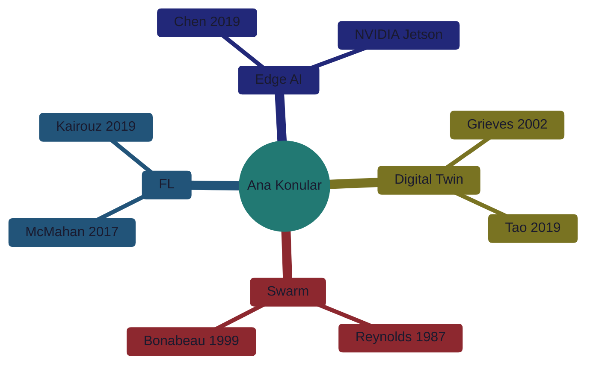

# 📚 Literatür Taraması (Literature Review)

> **"Devlerin omuzlarında durmak."** - Isaac Newton

---

## 📋 İçindekiler

- [Temel Makaleler](#-temel-makaleler)
- [Digital Twin](#-digital-twin)
- [Swarm Intelligence](#-swarm-intelligence)
- [Federated Learning](#-federated-learning)
- [Edge AI & Robotics](#-edge-ai--robotics)
- [Termal Görüntüleme](#-termal-görüntüleme)

---

## 🎯 Temel Makaleler



---

## 🪞 Digital Twin

### Temel Kaynaklar

| Makale | Yazar | Yıl | Link |
|--------|-------|-----|------|
| **Digital Twin: A Comprehensive Survey** | Liu et al. | 2021 | [arXiv:2011.02833](https://arxiv.org/abs/2011.02833) |
| **Digital Twin in Industry 4.0** | Tao et al. | 2019 | [ScienceDirect](https://doi.org/10.1016/j.rcim.2018.10.010) |
| **Origins of Digital Twin Concept** | Grieves | 2002 | [ResearchGate](https://www.researchgate.net/publication/307509727) |

### Önerilen Okuma Sırası

1. Grieves (2002) - Kavramın kökeni
2. Tao (2019) - Endüstri 4.0 uygulamaları
3. Liu (2021) - Kapsamlı survey

---

## 🐝 Swarm Intelligence

### Temel Kaynaklar

| Makale | Yazar | Yıl | Algoritma |
|--------|-------|-----|-----------|
| **Flocks, Herds, and Schools** | Reynolds | 1987 | Boids |
| **Swarm Intelligence: From Natural to Artificial** | Bonabeau et al. | 1999 | Genel |
| **Ant Colony Optimization** | Dorigo et al. | 1996 | ACO |
| **Particle Swarm Optimization** | Kennedy & Eberhart | 1995 | PSO |

### Multi-Robot Sistemler

| Makale | Odak | Link |
|--------|------|------|
| **Multi-Robot Coordination Survey** | Yan et al. | [IEEE](https://ieeexplore.ieee.org/) |
| **Cooperative UAV Systems** | Various | [arXiv](https://arxiv.org/) |

---

## 🔒 Federated Learning

### Temel Makaleler

| Makale | Katkı | Link |
|--------|-------|------|
| **Communication-Efficient Learning (FedAvg)** | McMahan 2017 | [arXiv:1602.05629](https://arxiv.org/abs/1602.05629) |
| **Advances and Open Problems in FL** | Kairouz 2019 | [arXiv:1912.04977](https://arxiv.org/abs/1912.04977) |
| **FedProx: Heterogeneous Networks** | Li 2020 | [arXiv:1812.06127](https://arxiv.org/abs/1812.06127) |

### Edge FL

| Makale | Odak |
|--------|------|
| **Federated Learning on Edge Devices** | Mobil FL |
| **Privacy-Preserving FL** | Güvenlik |

---

## 🤖 Edge AI & Robotics

### Jetson & Embedded AI

| Kaynak | Tür | Link |
|--------|-----|------|
| **NVIDIA Jetson Developer Guide** | Dokümantasyon | [developer.nvidia.com](https://developer.nvidia.com/embedded/learn/getting-started-jetson) |
| **TensorRT Best Practices** | Guide | [NVIDIA Docs](https://docs.nvidia.com/deeplearning/tensorrt/) |
| **Edge AI: A Vision** | Survey | [arXiv](https://arxiv.org/) |

### ROS 2

| Kaynak | Açıklama |
|--------|----------|
| **ROS 2 Design** | Mimari kararlar |
| **Navigation2** | Otonom navigasyon stack |
| **MoveIt2** | Manipülasyon |

---

## 🔥 Termal Görüntüleme

### Uydu Termal

| Kaynak | Sensör | Çözünürlük |
|--------|--------|------------|
| **Landsat TIRS** | Band 10, 11 | 100m |
| **MODIS LST** | Land Surface Temp | 1km |
| **ECOSTRESS** | ISS termal | 70m |

### Drone Termal

| Makale | Uygulama |
|--------|----------|
| **UAV Thermal Inspection** | Bina denetimi |
| **Precision Agriculture** | Tarım |
| **Search and Rescue** | Arama kurtarma |

---

## 📝 Atıf Formatı

### BibTeX Örneği

```bibtex
@article{mcmahan2017fedavg,
  title={Communication-Efficient Learning of Deep Networks from Decentralized Data},
  author={McMahan, Brendan and Moore, Eider and Ramage, Daniel and others},
  journal={Artificial Intelligence and Statistics},
  year={2017}
}

@article{tao2019digital,
  title={Digital Twin in Industry: State-of-the-Art},
  author={Tao, Fei and Cheng, Jiangfeng and Qi, Qinglin},
  journal={IEEE Transactions on Industrial Informatics},
  year={2019}
}
```

---

## 🔗 Faydalı Kaynaklar

| Platform | Link | Açıklama |
|----------|------|----------|
| arXiv | [arxiv.org](https://arxiv.org/) | Preprint makaleler |
| IEEE Xplore | [ieeexplore.ieee.org](https://ieeexplore.ieee.org/) | Mühendislik |
| Google Scholar | [scholar.google.com](https://scholar.google.com/) | Arama |
| Semantic Scholar | [semanticscholar.org](https://www.semanticscholar.org/) | AI destekli |
| Papers With Code | [paperswithcode.com](https://paperswithcode.com/) | Kod + Makale |

---

> 💡 **Katkı:** Yeni makale önermek için [issue açın](https://github.com/).
