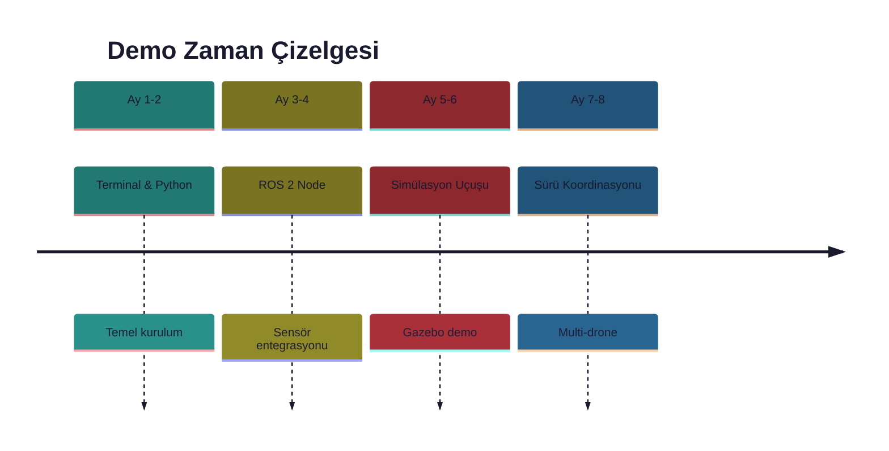

# 🎬 Demo Vitrin (Showcase)

> **"Bir resim bin kelimeye bedeldir, bir demo milyon kelimeye."**

---

## 📋 İçindekiler

- [Proje Demoları](#-proje-demoları)
- [Video Galerisi](#-video-galerisi)
- [Sunum Materyalleri](#-sunum-materyalleri)
- [Poster ve Görseller](#-poster-ve-görseller)

---

## 🎯 Proje Demoları



### Demo Listesi

| Demo | Açıklama | Durum |
|------|----------|-------|
| 🖥️ Hello Drone | İlk Python script | ⬜ Bekliyor |
| 📡 RealSense ROS | PointCloud görselleştirme | ⬜ Bekliyor |
| 🔥 Termal Overlay | RealSense + Termal fusion | ⬜ Bekliyor |
| 🎮 Gazebo Uçuş | PX4 SITL demo | ⬜ Bekliyor |
| 🤖 Object Detection | Jetson inference | ⬜ Bekliyor |
| 🐝 Swarm Sim | 3 drone koordinasyonu | ⬜ Bekliyor |
| 🪞 Digital Twin | Termal 3D model | ⬜ Bekliyor |
| 🔒 FL Demo | Federated Learning round | ⬜ Bekliyor |

---

## 📹 Video Galerisi

### Planlanan Videolar

| Video | Süre | Platform | Link |
|-------|------|----------|------|
| Proje Tanıtımı | 3 dk | YouTube | 🔜 |
| Donanım Unboxing | 5 dk | YouTube | 🔜 |
| ROS 2 Tutorial | 10 dk | YouTube | 🔜 |
| Simülasyon Demo | 5 dk | YouTube | 🔜 |
| Final Showcase | 10 dk | YouTube | 🔜 |

### Video Şablonu

```markdown
## [Video Başlık]

📅 Tarih: YYYY-MM-DD
⏱️ Süre: X dakika
🔗 Link: [YouTube](https://youtube.com/...)

### Özet
Kısa açıklama...

### Zaman Damgaları
- 0:00 Giriş
- 1:00 Demo başlangıç
- 3:00 Sonuçlar
```

---

## 📊 Sunum Materyalleri

### Sunum Listesi

| Sunum | Kitle | Format |
|-------|-------|--------|
| Proje Pitch | Genel | 10 slide |
| Teknik Derinlik | Mühendisler | 25 slide |
| Akademik | Hocalar | 15 slide |
| Demo Day | Jüri | 20 slide |

### Slide Şablonu

```
Slide 1: Başlık + İsim
Slide 2: Problem Tanımı
Slide 3: Çözüm Önerisi
Slide 4: Mimari
Slide 5: Demo
Slide 6: Sonuçlar
Slide 7: Sonraki Adımlar
Slide 8: Sorular
```

---

## 🖼️ Poster ve Görseller

### Planlanan Görseller

| Görsel | Boyut | Kullanım |
|--------|-------|----------|
| Proje Logosu | 512x512 | GitHub, sosyal medya |
| Mimari Diyagram | 1920x1080 | Sunum, poster |
| Donanım Fotoğrafları | Çeşitli | Dokümantasyon |
| Demo GIF'ler | 800x600 | README, docs |

### Banner Şablonu

```
┌────────────────────────────────────────────┐
│  🚁 Thermal Digital Twin Swarm Project    │
│  ─────────────────────────────────────────│
│  Edge AI | Swarm Intelligence | FL        │
│                                            │
│  [Jetson Logo] [ROS2 Logo] [PX4 Logo]     │
└────────────────────────────────────────────┘
```

---

## 📁 Dosya Organizasyonu

```
07-Demos/
├── showcase.md          ← Bu dosya
├── videos/
│   ├── demo_01_hello.mp4
│   ├── demo_02_ros.mp4
│   └── ...
├── presentations/
│   ├── pitch_deck.pdf
│   ├── technical_deep_dive.pdf
│   └── ...
├── images/
│   ├── logo.png
│   ├── architecture.png
│   └── ...
└── gifs/
    ├── simulation.gif
    ├── detection.gif
    └── ...
```

---

## ✅ Showcase Checklist

- [ ] Logo tasarlandı
- [ ] Banner oluşturuldu
- [ ] İlk demo videosu çekildi
- [ ] Sunum hazırlandı
- [ ] GIF'ler oluşturuldu
- [ ] YouTube kanalı açıldı

---

## 🏆 İlham Kaynakları

### Benzer Projeler

| Proje | Link | İlham |
|-------|------|-------|
| PX4 Autopilot | [px4.io](https://px4.io) | Uçuş kontrolü |
| ArduPilot | [ardupilot.org](https://ardupilot.org) | Otonom sistemler |
| NVIDIA Isaac | [NVIDIA](https://developer.nvidia.com/isaac-ros) | Edge AI |
| Dronecode | [dronecode.org](https://www.dronecode.org/) | Açık kaynak drone |

---

> 💡 **Katkı:** Demo ekleme için [CONTRIBUTING.md](../CONTRIBUTING.md) rehberine bakın.
