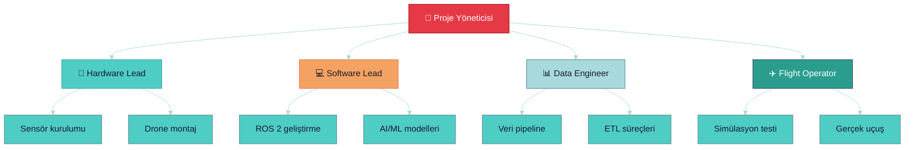

# 👥 Rol ve Sorumluluklar

> **"Herkes her şeyi yaparsa, hiçbir şey yapılmaz."**

---

## 📋 İçindekiler

- [Takım Yapısı](#-takım-yapısı)
- [Rol Tanımları](#-rol-tanımları)
- [Sorumluluk Matrisi](#-sorumluluk-matrisi)
- [İletişim Protokolü](#-iletişim-protokolü)

---

## 🏗️ Takım Yapısı

---

## 📝 Rol Tanımları

### 🎯 Proje Yöneticisi (PM)

| Alan | Sorumluluk |
|------|------------|
| Planlama | Sprint planlama, timeline |
| Koordinasyon | Takım arası iletişim |
| Risk | Risk yönetimi, karar alma |
| Raporlama | İlerleme raporları |

### 🔧 Hardware Lead

| Alan | Sorumluluk |
|------|------------|
| Jetson | Kurulum, konfigürasyon |
| Sensörler | RealSense, termal kamera |
| Drone | Montaj, bakım, test |
| Entegrasyon | Donanım-yazılım köprüsü |

### 💻 Software Lead

| Alan | Sorumluluk |
|------|------------|
| ROS 2 | Node geliştirme, launch |
| AI/ML | Model eğitimi, deployment |
| Docker | Container yönetimi |
| CI/CD | Test, deployment pipeline |

### 📊 Data Engineer

| Alan | Sorumluluk |
|------|------------|
| Uydu verisi | İndirme, ön işleme |
| ETL | Pipeline geliştirme |
| Storage | Veri yönetimi |
| FL | Federated Learning altyapısı |

### ✈️ Flight Operator

| Alan | Sorumluluk |
|------|------------|
| Simülasyon | Gazebo testleri |
| Gerçek uçuş | Pilot görevleri |
| Güvenlik | Pre-flight checklist |
| Kayıt | Log, video kayıtları |

---

## 📊 Sorumluluk Matrisi (RACI)

| Görev | PM | HW | SW | DATA | PILOT |
|-------|----|----|----|----|-------|
| Sprint planlama | **R** | C | C | C | C |
| Jetson kurulum | A | **R** | C | I | I |
| ROS 2 geliştirme | A | C | **R** | C | I |
| Veri pipeline | A | I | C | **R** | I |
| Simülasyon test | A | C | C | I | **R** |
| Gerçek uçuş | A | C | I | I | **R** |
| Risk değerlendirme | **R** | C | C | C | C |

**Açıklama:**
- **R** = Responsible (Yürütücü)
- **A** = Accountable (Sorumlu)
- **C** = Consulted (Danışılan)
- **I** = Informed (Bilgilendirilen)

---

## 📞 İletişim Protokolü

### Kanallar

| Kanal | Kullanım | Aciliyet |
|-------|----------|----------|
| Slack/Discord | Günlük iletişim | Normal |
| GitHub Issues | Bug, feature | Normal |
| WhatsApp | Acil durumlar | Yüksek |
| Toplantı | Haftalık sync | Planlı |

### Toplantı Takvimi

| Toplantı | Sıklık | Süre | Katılımcı |
|----------|--------|------|-----------|
| Daily standup | Günlük | 15 dk | Tüm takım |
| Sprint planning | 2 haftada | 1 saat | Tüm takım |
| Technical review | Haftalık | 30 dk | HW + SW |
| Demo day | 2 haftada | 1 saat | Tüm takım |

---

## ✅ Takım Checklist

- [ ] Roller atandı
- [ ] İletişim kanalları kuruldu
- [ ] Toplantı takvimi belirlendi
- [ ] GitHub erişimleri verildi
- [ ] Onboarding tamamlandı

---

> 💡 **Sonraki:** [README.md](../README.md) - Ana sayfaya dön
