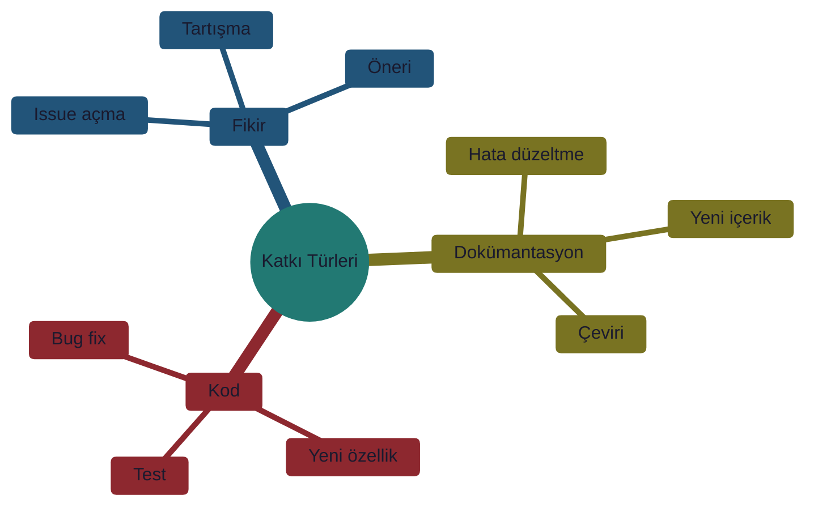
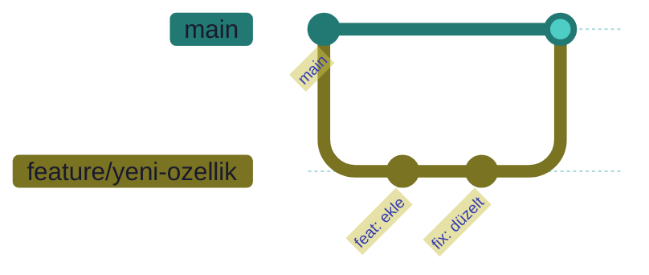

# 🤝 Katkıda Bulunma Rehberi

> **"Açık kaynak, birlikte büyümektir."**

---

## 📋 İçindekiler

- [Hoş Geldiniz](#-hoş-geldiniz)
- [Nasıl Katkıda Bulunabilirim?](#-nasıl-katkıda-bulunabilirim)
- [Kod Standartları](#-kod-standartları)
- [Pull Request Süreci](#-pull-request-süreci)
- [İletişim](#-iletişim)

---

## 👋 Hoş Geldiniz

Bu projeye katkıda bulunmak istediğiniz için teşekkür ederiz! Her türlü katkı değerlidir:



---

## 🛠️ Nasıl Katkıda Bulunabilirim?

### 1. Issue Açma

**Bug Raporu:**
```markdown
## Bug Açıklaması
Kısa ve net açıklama.

## Tekrar Etme Adımları
1. Şuraya git '...'
2. Şuna tıkla '...'
3. Hata mesajı '...'

## Beklenen Davranış
Ne olması gerekiyordu?

## Ekran Görüntüsü
Varsa ekleyin.

## Ortam
- OS: Ubuntu 22.04
- Python: 3.10
- ROS 2: Humble
```

**Özellik İsteği:**
```markdown
## Özellik Açıklaması
Ne istiyorsunuz?

## Kullanım Senaryosu
Neden gerekli?

## Alternatifler
Başka çözüm denediniz mi?
```

### 2. Fork ve Clone

```bash
# Fork yaptıktan sonra
git clone https://github.com/YOUR_USERNAME/project.git
cd project
git remote add upstream https://github.com/ORIGINAL/project.git
```

### 3. Branch Oluşturma



**Branch İsimlendirme:**

| Prefix | Kullanım | Örnek |
|--------|----------|-------|
| `feature/` | Yeni özellik | `feature/thermal-detection` |
| `fix/` | Bug düzeltme | `fix/memory-leak` |
| `docs/` | Dokümantasyon | `docs/ros2-guide` |
| `refactor/` | Kod iyileştirme | `refactor/sensor-module` |

---

## 📏 Kod Standartları

### Python

```python
"""
Modül açıklaması.

Bu modül şunu yapar...
"""

from typing import List, Optional
import numpy as np


def calculate_thermal_anomaly(
    thermal_data: np.ndarray,
    threshold: float = 10.0,
    min_area: int = 100
) -> List[dict]:
    """
    Termal anomali hesapla.
    
    Args:
        thermal_data: Termal görüntü array'i
        threshold: Sıcaklık eşiği (°C)
        min_area: Minimum alan (piksel)
    
    Returns:
        Anomali listesi
    
    Raises:
        ValueError: Geçersiz veri boyutu
    
    Example:
        >>> data = np.random.rand(100, 100) * 50
        >>> anomalies = calculate_thermal_anomaly(data)
    """
    if thermal_data.ndim != 2:
        raise ValueError("2D array bekleniyor")
    
    # İşlem...
    return []
```

### Markdown

| Kural | Açıklama |
|-------|----------|
| Başlıklar | `#` ile hiyerarşik |
| Kod blokları | ``` ile dil belirt |
| Emoji | Abartısız, tutarlı |
| Linkler | Çalışır durumda |

---

## 🔄 Pull Request Süreci

### Checklist

- [ ] Kod çalışıyor
- [ ] Testler geçiyor
- [ ] Dokümantasyon güncellendi
- [ ] Commit mesajları açık
- [ ] Branch güncel

### Commit Mesajları

```
<tip>(<kapsam>): <açıklama>

[opsiyonel gövde]

[opsiyonel footer]
```

**Tipler:**
| Tip | Açıklama |
|-----|----------|
| `feat` | Yeni özellik |
| `fix` | Bug düzeltme |
| `docs` | Dokümantasyon |
| `style` | Formatlama |
| `refactor` | Kod iyileştirme |
| `test` | Test ekleme |

**Örnekler:**
```
feat(thermal): termal anomali tespiti ekle
fix(ros2): topic isim çakışması düzelt
docs(readme): kurulum adımları güncelle
```

### PR Template

```markdown
## Değişiklik Özeti
Bu PR ne yapıyor?

## İlgili Issue
Fixes #123

## Test Edildi Mi?
- [ ] Birim testleri
- [ ] Entegrasyon testleri
- [ ] Manuel test

## Ekran Görüntüsü
Varsa ekleyin.
```

---

## 💬 İletişim

| Kanal | Kullanım |
|-------|----------|
| GitHub Issues | Bug, özellik istekleri |
| Discussions | Genel sorular, fikirler |
| Email | Özel konular |

---

## 🙏 Teşekkürler

Katkıda bulunan herkese teşekkür ederiz! 

---

> 💡 **Sorularınız için:** GitHub Issues açın
