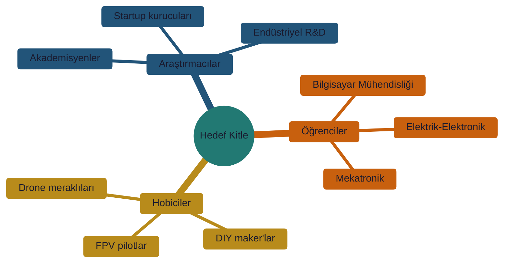
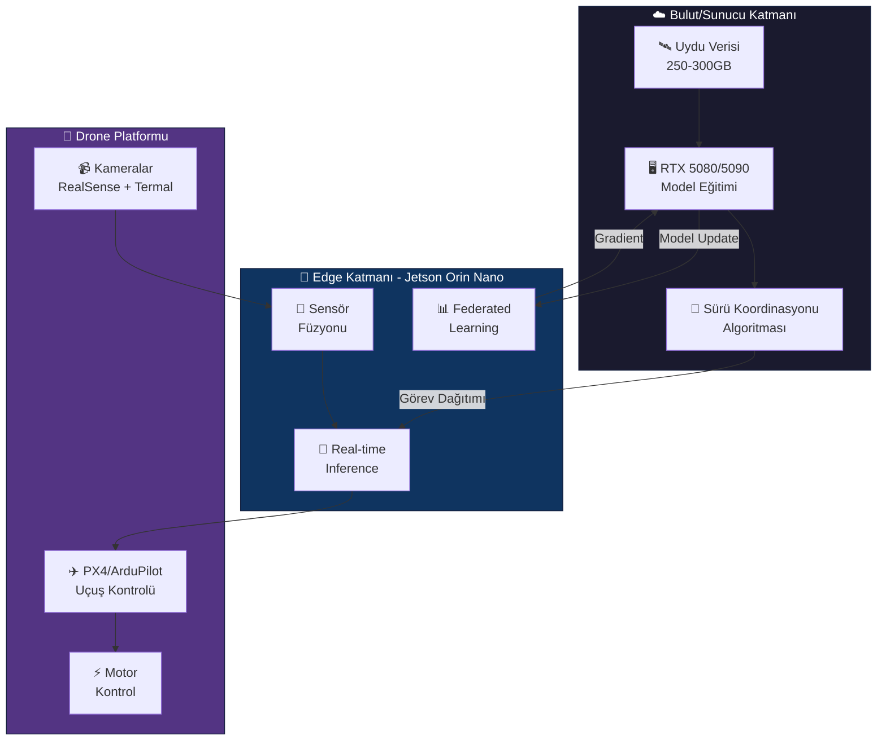
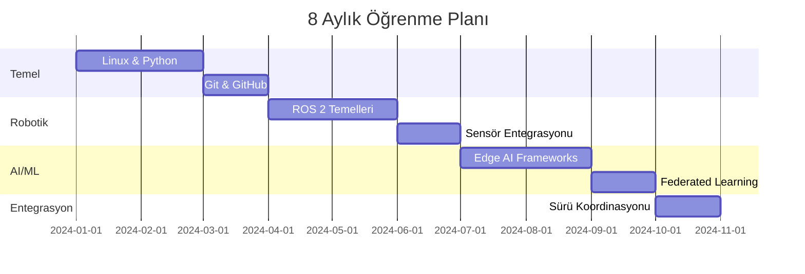

# 🚁 Thermal Digital Twin & Swarm Intelligence Öğrenme Merkezi

[](https://github.com/)
[](https://developer.nvidia.com/embedded/jetson-orin-nano)
[](https://docs.ros.org/)

> 🎯 **Geleceğin Mühendislik Haritası:** Edge AI, sürü drone koordinasyonu ve termal dijital ikiz sistemleri için kapsamlı bir öğrenme deposu.

---

## 📋 İçindekiler

- [Bu Repo Nedir?](#-bu-repo-nedir)
- [Hedef Kitle](#-hedef-kitle)
- [Donanım Envanteri](#-donanım-envanteri)
- [Sistem Mimarisi](#-sistem-mimarisi)
- [Öğrenme Yol Haritası](#-öğrenme-yol-haritası)
- [Dizin Yapısı](#-dizin-yapısı)
- [Hızlı Başlangıç](#-hızlı-başlangıç)
- [Katkıda Bulunma](#-katkıda-bulunma)
- [Lisans](#-lisans)

---

## 🎯 Bu Repo Nedir?

### ✅ Bu Repo NEDİR

| Özellik | Açıklama |
|---------|----------|
| 📚 **Eğitim Kaynağı** | Türkçe dokümantasyon ve öğrenme materyalleri |
| 🗺️ **Yol Haritası** | Sıfırdan ileri seviyeye adım adım rehber |
| 🧪 **Simülasyon Öncelikli** | Fiziksel drone olmadan öğrenme imkanı |
| 🤝 **Açık Kaynak** | Herkesin katkıda bulunabileceği canlı döküman |

### ❌ Bu Repo NE DEĞİLDİR

| Değil | Açıklama |
|-------|----------|
| 🚀 Hazır Ürün | Çalışır kod implementasyonu (henüz) |
| 💰 Ticari Proje | Akademik/hobi amaçlı öğrenme odaklı |
| 📦 Paket/Kütüphane | Kurulabilir bir yazılım değil |

> 📝 **İsim Açıklaması:** Bu repository, AI asistanları kullanılarak oluşturulmuş dokümantasyon kaynakları içerir. "AI generated" = yapay zeka destekli öğrenme materyalleri anlamına gelir.

---

## 👥 Hedef Kitle



### Ön Gereksinimler

| Seviye | Beklenen Bilgi |
|--------|----------------|
| 🟢 Başlangıç | Temel programlama mantığı (herhangi bir dil) |
| 🟡 Orta | Python temelleri, Linux komut satırı |
| 🔴 İleri | ROS 2 deneyimi, ML/AI temelleri |

---

## 🛠️ Donanım Envanteri

### Edge Computing Platformu

| Bileşen | Model | Rol | Temel Özellik |
|---------|-------|-----|---------------|
| 🧠 **İşlemci** | NVIDIA Jetson Orin Nano | Edge AI Beyin | 40 TOPS AI performansı |
| 👁️ **Derinlik** | Intel RealSense D455 | 3D Görüş | Stereo derinlik + IMU |
| 🔥 **Termal** | UNI-T UTi260B | Isı Algılama | 256×192 termal çözünürlük |

### Sunucu Altyapısı

| Bileşen | Konfigürasyon | Görev |
|---------|---------------|-------|
| 🖥️ **GPU Sunucu** | RTX 5080/5090 | Model eğitimi, uydu verisi işleme |
| 💾 **RAM** | 128-256 GB | Büyük veri seti işleme (250-300GB) |
| 🐧 **İşletim Sistemi** | Ubuntu Server + Windows | Hybrid altyapı |

### Veri Kaynakları

| Kaynak | Boyut | Format | Kullanım |
|--------|-------|--------|----------|
| 🛰️ **Uydu Verisi** | 250-300 GB | GeoTIFF, HDF5 | Termal haritalama, arazi analizi |
| 📡 **Real-time** | Değişken | RTSP, ROS topics | Canlı sensör akışı |

---

## 🏗️ Sistem Mimarisi



### Temel Kavramlar

| Kavram | İngilizce | Açıklama |
|--------|-----------|----------|
| 🔥 **Termal Dijital İkiz** | Thermal Digital Twin | Fiziksel sistemin ısı haritası simülasyonu |
| 🐝 **Sürü Zekası** | Swarm Intelligence | Çoklu drone koordinasyonu |
| 🔒 **Dağıtık Öğrenme** | Federated Learning | Veri paylaşmadan model eğitimi |
| 📍 **Otonom Navigasyon** | Autonomous Navigation | GPS-denied ortamda yön bulma |

---

## 🗺️ Öğrenme Yol Haritası



| Ay | Seviye | Odak Alanı | Milestone |
|----|--------|------------|-----------|
| 1-2 | 🟢 Temel | Linux, Python, Git | İlk script'i yaz |
| 3-4 | 🟡 Robotik | ROS 2, Docker | İlk simülasyon uçuşu |
| 5-6 | 🔴 AI/ML | TensorRT, FL | Jetson'da inference |
| 7-8 | ⚫ Entegrasyon | Sürü sistemi | Çoklu drone koordinasyonu |

---

## 📂 Dizin Yapısı

```
📁 AI_generated_resources/
├── 📄 README.md                      ← Şu an buradasın
├── 📄 .cursorrules                   ← AI asistan kuralları
├── 📄 CONTRIBUTING.md                ← Katkı rehberi
│
├── 📁 00-Start-Here/                 ← İlk adım
│   ├── hardware-anatomy.md           ← Donanım tanıtımı
│   ├── quick-start-guide.md          ← 30 dakikada başla
│   └── glossary.md                   ← Terim sözlüğü
│
├── 📁 01-Concepts/                   ← Teorik temeller
│   ├── digital-twin-swarm.md         ← Ana kavramlar
│   └── safety-ethics.md              ← Güvenlik ve etik
│
├── 📁 02-Data-Management/            ← Veri yönetimi
│   ├── data-pipeline.md              ← ETL süreci
│   └── data-source-comparison.md     ← Kaynak karşılaştırma
│
├── 📁 03-Software-Stack/             ← Yazılım araçları
│   ├── essential-skills.md           ← Öğrenme yolu
│   ├── server-drone-architecture.md  ← Mimari tasarım
│   └── network-optimization.md       ← Ağ optimizasyonu
│
├── 📁 04-Roadmap/                    ← Proje planı
│   ├── project-timeline.md           ← Zaman çizelgesi
│   └── learning-milestones.md        ← Öğrenme hedefleri
│
├── 📁 05-Simulation/                 ← Simülasyon ortamı
│   ├── simulation-setup.md           ← Gazebo kurulumu
│   ├── gazebo-to-real-transition.md  ← Gerçeğe geçiş
│   └── hardware-testing-protocol.md  ← Test protokolü
│
├── 📁 06-Research/                   ← Akademik kaynaklar
│   └── literature-review.md          ← Makale taraması
│
├── 📁 07-Demos/                      ← Gösteriler
│   └── showcase.md                   ← Video ve sunumlar
│
└── 📁 08-Team-Collaboration/         ← Ekip çalışması
    ├── roles-responsibilities.md     ← Rol dağılımı
    └── task-assignment.md            ← Görev takibi
```

---

## 🚀 Hızlı Başlangıç

### 1️⃣ Önce Oku

```bash
# Önerilen okuma sırası
1. 00-Start-Here/hardware-anatomy.md      # Donanımı tanı
2. 01-Concepts/digital-twin-swarm.md      # Kavramları öğren
3. 03-Software-Stack/essential-skills.md  # Yol haritanı çiz
```

### 2️⃣ Geliştirme Ortamı

```bash
# Ubuntu 22.04 LTS önerilir
# ROS 2 Humble kurulumu için:
# Detaylar: 03-Software-Stack/essential-skills.md
```

### 3️⃣ Simülasyon

```bash
# Gazebo Ignition Fortress
# PX4 SITL kurulumu
# Detaylar: 05-Simulation/simulation-setup.md
```

---

## 🤝 Katkıda Bulunma

Katkılarınızı bekliyoruz! Lütfen [CONTRIBUTING.md](CONTRIBUTING.md) dosyasını inceleyin.

### Katkı Türleri

| Tür | Açıklama |
|-----|----------|
| 📝 Dokümantasyon | Hata düzeltme, ekleme, çeviri |
| 💡 Fikir | Issue açarak öneri sunma |
| 🐛 Bug Report | Hatalı bilgi bildirimi |
| 🔬 Araştırma | Yeni makale/kaynak ekleme |

---

## 📚 Daha Fazla Okuma

### Resmi Dokümantasyonlar
- [NVIDIA Jetson Documentation](https://developer.nvidia.com/embedded/learn/getting-started-jetson)
- [ROS 2 Humble Docs](https://docs.ros.org/en/humble/)
- [PX4 Autopilot Guide](https://docs.px4.io/)

### Akademik Kaynaklar
- [Digital Twin: A Comprehensive Survey](https://arxiv.org/abs/2011.02833)
- [Federated Learning: Strategies for Improving Communication Efficiency](https://arxiv.org/abs/1610.05492)
- [Swarm Intelligence: From Natural to Artificial Systems](https://mitpress.mit.edu/9780195131598/)

---

## 📜 Lisans

Bu proje [MIT Lisansı](LICENSE) altında yayınlanmıştır.

---

<div align="center">

**🚁 Hayal et. Öğren. İnşa et. 🚁**

*Bu repository, Bilgisayar Mühendisliği öğrencileri için oluşturulmuş bir öğrenme kaynağıdır.*

[](https://github.com/)

</div>
